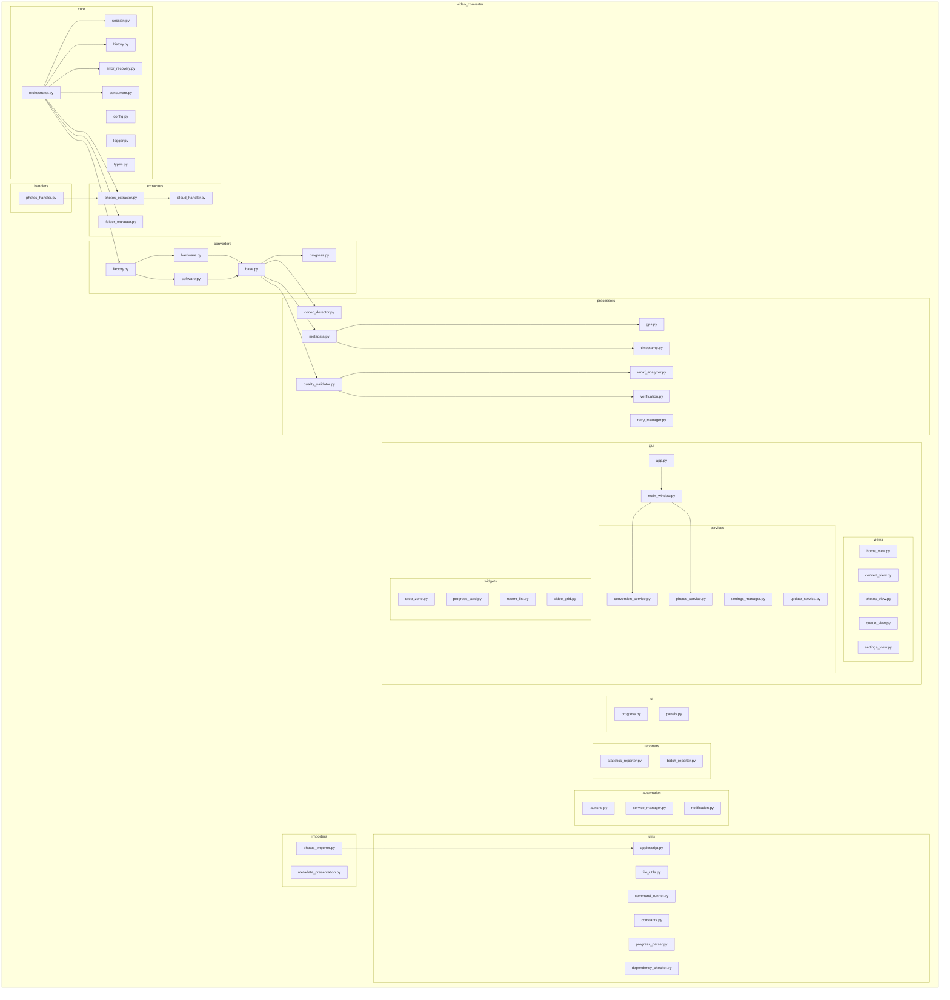
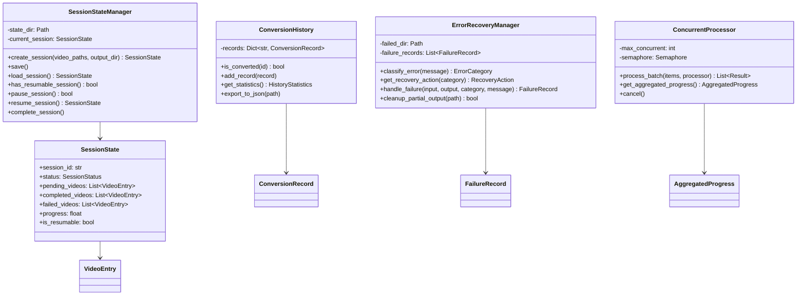
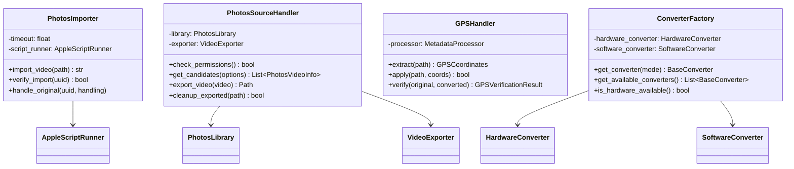
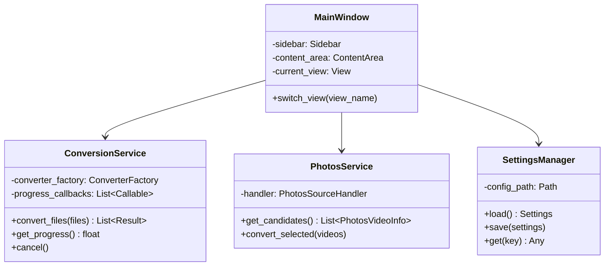

# 시스템 아키텍처

> **Version:** 1.2.0
> **Last Updated:** 2025-12-24

## 1. 전체 시스템 구조

### 1.1 계층형 아키텍처


### 1.2 컴포넌트 상세


### 1.3 컴포넌트 책임

| 컴포넌트 | 기술 | 책임 |
|---------|------|------|
| Scheduler | launchd/Python | 일정/이벤트 기반 실행 관리 |
| Orchestrator | Python | 전체 변환 워크플로우 조율 |
| Config Manager | Python/JSON | 설정 파일 관리 |
| Video Extractor | osxphotos | Photos 라이브러리에서 비디오 추출 |
| Codec Detector | FFprobe | 비디오 코덱 분석 |
| Video Converter | FFmpeg | H.264→H.265 변환 |
| Metadata Processor | ExifTool | 메타데이터 보존/복원 |
| Video Validator | FFmpeg | 변환 결과 검증 |
| Reporter | Python | 통계 및 보고서 생성 |
| Notification | AppleScript | macOS 알림 발송 |
| Session Manager | Python/JSON | 변환 세션 상태 영속성 및 재개 지원 |
| Conversion History | Python/JSON | 변환 이력 추적 및 중복 방지 |
| Error Recovery | Python | 오류 분류, 복구 전략 결정 및 실패 격리 |
| Concurrent Processor | Python/asyncio | 병렬 변환 처리 및 리소스 관리 |
| GPS Handler | ExifTool | GPS 좌표 추출, 적용 및 보존 검증 |
| VMAF Analyzer | FFmpeg/libvmaf | 비디오 품질 점수 분석 |
| Converter Factory | Python | 인코더(HW/SW) 선택 및 인스턴스 생성 |
| Progress Monitor | Python/Regex | 실시간 FFmpeg 진행률 파싱 및 ETA 계산 |
| Photos Importer | AppleScript | 변환된 비디오를 Photos 라이브러리로 재가져오기 |
| Photos Handler | Python | Photos 소스와 CLI 인터페이스 통합 |
| iCloud Handler | Python | iCloud 전용 파일 다운로드 대기 및 처리 |
| AppleScript Runner | osascript | AppleScript 명령 실행 및 결과 파싱 |
| Dependency Checker | Python/subprocess | FFmpeg, ExifTool 등 시스템 의존성 확인 |
| GUI Services | Python/tkinter | 변환, Photos, 설정 서비스 제공 |
| GUI Widgets | Python/tkinter | 드래그앤드롭, 진행률 카드, 비디오 그리드 |

## 2. 모듈 구조

### 2.1 패키지 다이어그램



### 2.2 클래스 다이어그램


### 2.3 Core 모듈 클래스 다이어그램



### 2.4 Importers/Handlers 클래스 다이어그램



### 2.5 GUI 모듈 클래스 다이어그램



## 3. 배포 다이어그램

### 3.1 시스템 배포 구조


### 3.2 배포 노드 상세


### 3.3 물리적 배포 경로

```
macOS System
├── /opt/homebrew/bin/                    # Homebrew CLI Tools
│   ├── ffmpeg                            # Video encoder/decoder
│   ├── ffprobe                           # Media analyzer
│   ├── exiftool                          # Metadata tool
│   └── python3                           # Python interpreter
│
├── ~/                                     # User Home
│   ├── Library/
│   │   ├── LaunchAgents/
│   │   │   └── com.user.videoconverter.plist
│   │   └── Logs/
│   │       └── video_converter/
│   │           ├── stdout.log
│   │           └── stderr.log
│   │
│   ├── Pictures/
│   │   └── Photos Library.photoslibrary/  # Photos Database
│   │
│   ├── Videos/
│   │   ├── ToConvert/                     # Watch directory
│   │   ├── Converted/                     # Output directory
│   │   ├── Processed/                     # Backup originals
│   │   └── Failed/                        # Failed conversions
│   │
│   └── .config/
│       └── video_converter/
│           └── config.json                # User configuration
│
└── /System/Library/Frameworks/            # System Frameworks
    ├── VideoToolbox.framework
    ├── CoreMedia.framework
    └── Photos.framework
```

## 4. 디렉토리 구조

```
video_converter/
├── src/
│   └── video_converter/
│       ├── __init__.py
│       ├── __main__.py              # CLI 엔트리포인트
│       ├── core/
│       │   ├── __init__.py
│       │   ├── orchestrator.py      # 메인 오케스트레이터
│       │   ├── config.py            # 설정 관리
│       │   ├── logger.py            # 로깅 설정
│       │   ├── types.py             # 핵심 데이터 타입 정의
│       │   ├── session.py           # 세션 상태 영속성 관리
│       │   ├── history.py           # 변환 이력 추적 (중복 방지)
│       │   ├── error_recovery.py    # 오류 복구 및 실패 격리
│       │   └── concurrent.py        # 병렬 처리 지원
│       ├── extractors/
│       │   ├── __init__.py
│       │   ├── photos_extractor.py  # Photos 라이브러리 추출
│       │   ├── folder_extractor.py  # 폴더 감시 추출
│       │   └── icloud_handler.py    # iCloud 파일 다운로드 처리
│       ├── converters/
│       │   ├── __init__.py
│       │   ├── base.py              # 추상 베이스 클래스
│       │   ├── hardware.py          # VideoToolbox 변환
│       │   ├── software.py          # libx265 변환
│       │   ├── factory.py           # 변환기 팩토리 패턴
│       │   └── progress.py          # 실시간 진행률 모니터링
│       ├── processors/
│       │   ├── __init__.py
│       │   ├── codec_detector.py    # 코덱 감지
│       │   ├── metadata.py          # 메타데이터 처리
│       │   ├── quality_validator.py # 품질 검증
│       │   ├── gps.py               # GPS 좌표 보존
│       │   ├── vmaf_analyzer.py     # VMAF 품질 분석
│       │   ├── verification.py      # 출력 파일 검증
│       │   ├── timestamp.py         # 타임스탬프 동기화
│       │   └── retry_manager.py     # 재시도 로직 관리
│       ├── importers/
│       │   ├── __init__.py
│       │   ├── photos_importer.py   # Photos 라이브러리 재가져오기
│       │   └── metadata_preservation.py  # 메타데이터 보존 처리
│       ├── handlers/
│       │   ├── __init__.py
│       │   └── photos_handler.py    # Photos 소스 핸들러 (CLI 통합)
│       ├── automation/
│       │   ├── __init__.py
│       │   ├── launchd.py           # launchd 설정 생성
│       │   ├── notification.py      # macOS 알림 발송
│       │   └── service_manager.py   # 서비스 관리
│       ├── reporters/
│       │   ├── __init__.py
│       │   ├── statistics_reporter.py  # 통계 리포터
│       │   └── batch_reporter.py       # 배치 리포터
│       ├── ui/
│       │   ├── __init__.py
│       │   ├── progress.py          # CLI 진행률 표시
│       │   └── panels.py            # 터미널 UI 패널
│       ├── utils/
│       │   ├── __init__.py
│       │   ├── file_utils.py        # 파일 유틸리티
│       │   ├── command_runner.py    # 명령 실행 유틸리티
│       │   ├── constants.py         # 상수 정의
│       │   ├── applescript.py       # AppleScript 실행 유틸리티
│       │   ├── progress_parser.py   # FFmpeg 진행률 파싱
│       │   └── dependency_checker.py # 시스템 의존성 확인
│       └── gui/
│           ├── __init__.py
│           ├── app.py               # GUI 애플리케이션 진입점
│           ├── main_window.py       # 메인 윈도우
│           ├── menubar/
│           │   ├── __init__.py
│           │   └── menubar_app.py   # 메뉴바 앱
│           ├── styles/
│           │   ├── __init__.py
│           │   └── theme.py         # UI 테마 설정
│           ├── views/
│           │   ├── __init__.py
│           │   ├── home_view.py     # 홈 뷰
│           │   ├── convert_view.py  # 변환 뷰
│           │   ├── photos_view.py   # Photos 뷰
│           │   ├── queue_view.py    # 큐 관리 뷰
│           │   └── settings_view.py # 설정 뷰
│           ├── services/
│           │   ├── __init__.py
│           │   ├── conversion_service.py  # 변환 서비스
│           │   ├── photos_service.py      # Photos 서비스
│           │   ├── settings_manager.py    # 설정 관리자
│           │   └── update_service.py      # 업데이트 서비스
│           ├── widgets/
│           │   ├── __init__.py
│           │   ├── drop_zone.py     # 드래그&드롭 영역
│           │   ├── progress_card.py # 진행률 카드
│           │   ├── recent_list.py   # 최근 항목 목록
│           │   └── video_grid.py    # 비디오 그리드 뷰
│           └── dialogs/
│               ├── __init__.py
│               └── result_dialog.py # 결과 대화상자
├── config/
│   ├── default.json                 # 기본 설정
│   └── launchd/
│       └── com.user.videoconverter.plist
├── scripts/
│   ├── install.sh                   # 설치 스크립트
│   ├── uninstall.sh                 # 제거 스크립트
│   └── convert_single.sh            # 단일 파일 변환
├── tests/
│   ├── __init__.py
│   ├── test_extractors.py
│   ├── test_converters.py
│   └── test_processors.py
├── docs/
│   ├── reference/                   # 참조 문서
│   └── architecture/                # 아키텍처 문서
├── pyproject.toml
└── README.md
```

## 5. 설정 스키마

### 5.1 ER 다이어그램


### 5.2 설정 필드 설명

| 섹션 | 필드 | 타입 | 설명 |
|------|------|------|------|
| **encoding** | mode | string | `hardware` 또는 `software` |
| | quality | int | 하드웨어 인코딩 품질 (1-100) |
| | crf | int | 소프트웨어 인코딩 CRF (0-51) |
| | preset | string | 인코딩 속도/품질 프리셋 |
| **paths** | input_dir | string | 입력 비디오 디렉토리 |
| | output_dir | string | 출력 비디오 디렉토리 |
| **automation** | method | string | `launchd`, `folder_action`, `manual` |
| | schedule | string | `hourly`, `daily`, `weekly` |
| | time | string | HH:MM 형식 실행 시간 |
| **photos** | auto_export | boolean | Photos에서 자동 내보내기 |
| | albums_include | string | 포함할 앨범 (쉼표 구분) |
| | albums_exclude | string | 제외할 앨범 (쉼표 구분) |
| **processing** | max_concurrent | int | 동시 변환 수 |
| | validate_quality | boolean | VMAF 품질 검증 활성화 |
| | min_vmaf_score | float | 최소 VMAF 점수 |
| **notification** | enabled | boolean | 알림 활성화 |
| | on_complete | boolean | 완료 시 알림 |
| | on_error | boolean | 에러 시 알림 |

## 6. 인터페이스 정의

### 6.1 VideoExtractor 인터페이스

```python
from abc import ABC, abstractmethod
from typing import List, Optional
from pathlib import Path
from dataclasses import dataclass
from datetime import datetime

@dataclass
class VideoInfo:
    path: Path
    original_name: str
    codec: str
    duration: float
    size: int
    creation_date: datetime
    location: Optional[tuple[float, float]]
    albums: List[str]

class VideoExtractor(ABC):
    @abstractmethod
    def extract_videos(self,
                       filter_codec: Optional[str] = None,
                       since_date: Optional[datetime] = None) -> List[VideoInfo]:
        """추출 대상 비디오 목록 반환"""
        pass

    @abstractmethod
    def export_video(self, video: VideoInfo, dest_dir: Path) -> Path:
        """비디오를 지정된 디렉토리로 내보내기"""
        pass
```

### 6.2 VideoConverter 인터페이스

```python
from abc import ABC, abstractmethod
from dataclasses import dataclass
from enum import Enum
from pathlib import Path
from typing import Optional

class ConversionStatus(Enum):
    PENDING = "pending"
    IN_PROGRESS = "in_progress"
    COMPLETED = "completed"
    FAILED = "failed"

@dataclass
class ConversionResult:
    status: ConversionStatus
    input_path: Path
    output_path: Optional[Path]
    original_size: int
    converted_size: Optional[int]
    compression_ratio: Optional[float]
    duration_seconds: float
    vmaf_score: Optional[float]
    error_message: Optional[str]

class VideoConverter(ABC):
    @abstractmethod
    def convert(self,
                input_path: Path,
                output_path: Path,
                preserve_metadata: bool = True) -> ConversionResult:
        """비디오 변환 실행"""
        pass

    @abstractmethod
    def get_progress(self) -> float:
        """현재 진행률 반환 (0.0 ~ 1.0)"""
        pass

    @abstractmethod
    def cancel(self) -> bool:
        """진행 중인 변환 취소"""
        pass
```

## 7. 에러 처리 전략


## 8. 시스템 요구사항

### 8.1 하드웨어 요구사항

| 항목 | 최소 | 권장 |
|------|------|------|
| CPU | Apple M1 | Apple M2 Pro 이상 |
| RAM | 8GB | 16GB 이상 |
| Storage | 변환 대상의 2배 | 변환 대상의 3배 |

### 8.2 소프트웨어 요구사항

| 소프트웨어 | 버전 | 설치 방법 |
|------------|------|-----------|
| macOS | 12.0+ (Monterey) | - |
| Python | 3.10+ | `brew install python@3.12` |
| FFmpeg | 5.0+ | `brew install ffmpeg` |
| ExifTool | 12.0+ | `brew install exiftool` |
| osxphotos | 0.70+ | `pip install osxphotos` |

---

## 9. 변경 이력

| 버전 | 날짜 | 변경 내용 |
|------|------|-----------|
| 1.0.0 | 2024-01-01 | 초기 문서 작성 |
| 1.1.0 | 2024-12-24 | 파일명 및 클래스명 실제 구현과 일치하도록 업데이트 (Issue #192) |
