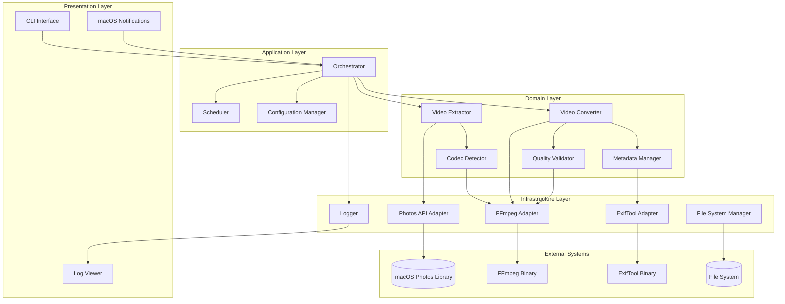
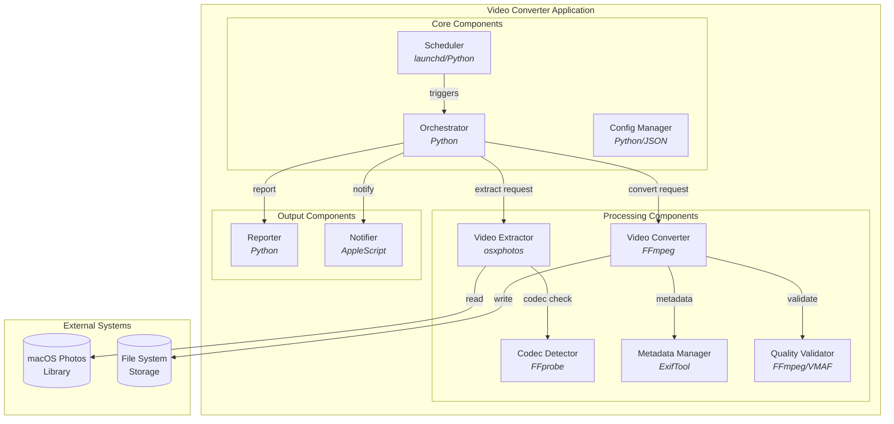
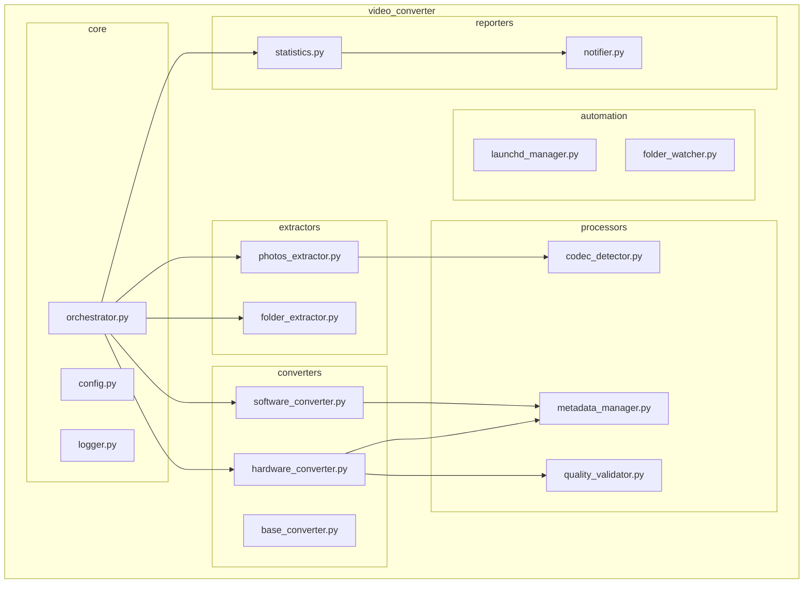
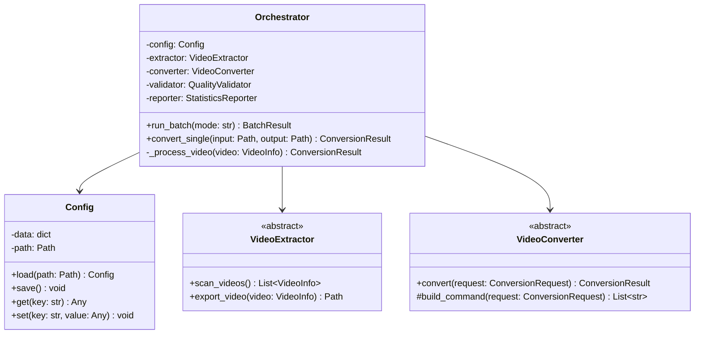
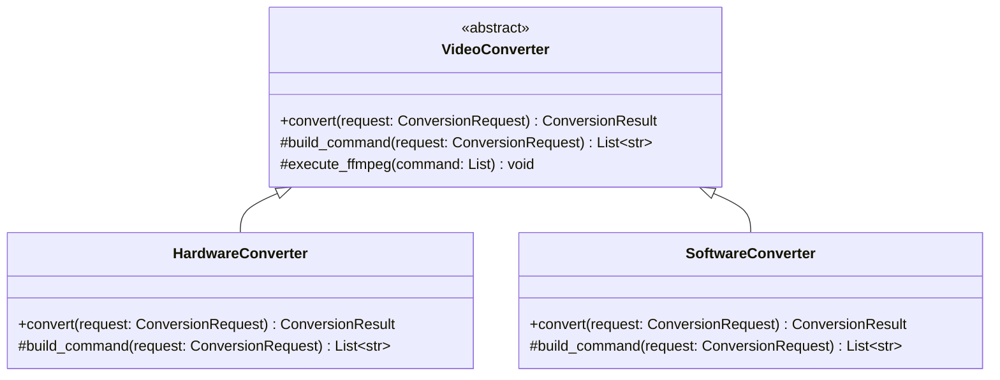
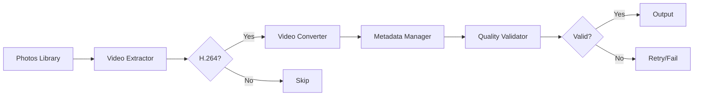
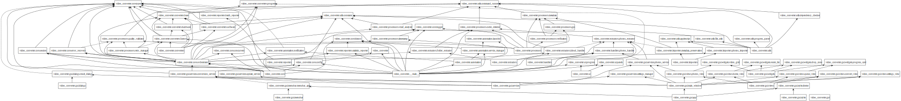
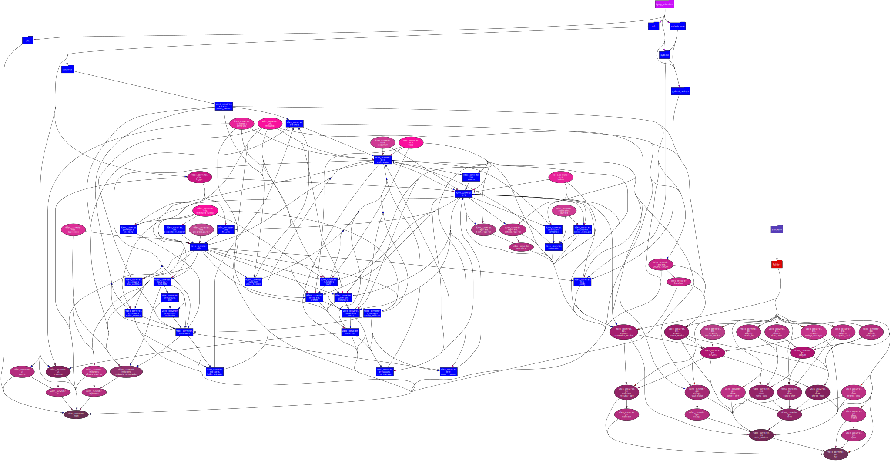
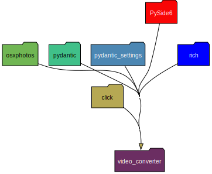
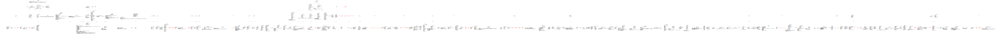

# System Architecture

## 1. Overall System Structure

### 1.1 Layered Architecture



### 1.2 Component Details



### 1.3 Component Responsibilities

| Component | Technology | Responsibility |
|-----------|------------|----------------|
| Scheduler | launchd/Python | Schedule/event-based execution management |
| Orchestrator | Python | Coordinate entire conversion workflow |
| Config Manager | Python/JSON | Configuration file management |
| Video Extractor | osxphotos | Extract videos from Photos library |
| Codec Detector | FFprobe | Analyze video codecs |
| Video Converter | FFmpeg | H.264→H.265 conversion |
| Metadata Manager | ExifTool | Metadata preservation/restoration |
| Quality Validator | FFmpeg/VMAF | Conversion quality validation |
| Reporter | Python | Statistics and report generation |
| Notifier | AppleScript | macOS notification delivery |

## 2. Module Structure

### 2.1 Package Diagram



### 2.2 Directory Structure

```
video_converter/
├── src/
│   └── video_converter/
│       ├── __init__.py
│       ├── main.py
│       ├── core/
│       │   ├── orchestrator.py
│       │   ├── config.py
│       │   └── logger.py
│       ├── extractors/
│       │   ├── base.py
│       │   ├── photos_extractor.py
│       │   └── folder_extractor.py
│       ├── converters/
│       │   ├── base.py
│       │   ├── hardware_converter.py
│       │   └── software_converter.py
│       ├── processors/
│       │   ├── codec_detector.py
│       │   ├── metadata_manager.py
│       │   └── quality_validator.py
│       ├── automation/
│       │   ├── launchd_manager.py
│       │   └── folder_watcher.py
│       ├── reporters/
│       │   ├── statistics.py
│       │   └── notifier.py
│       └── utils/
│           ├── file_utils.py
│           └── command_runner.py
├── config/
│   └── defaults.json
├── tests/
└── scripts/
    ├── install.sh
    └── uninstall.sh
```

## 3. Class Diagrams

### 3.1 Core Classes



### 3.2 Converter Hierarchy



## 4. Data Flow

### 4.1 Conversion Pipeline



## 5. Deployment

### 5.1 Installation Structure

```
~/
├── Library/
│   ├── LaunchAgents/
│   │   └── com.user.videoconverter.plist
│   └── Logs/
│       └── video_converter/
├── .config/
│   └── video_converter/
│       ├── config.json
│       └── history.db
└── Videos/
    └── VideoConverter/
        ├── output/
        ├── processed/
        └── failed/
```

## 6. System Requirements

### 6.1 Hardware Requirements

| Item | Minimum | Recommended |
|------|---------|-------------|
| CPU | Apple M1 | Apple M2 Pro or better |
| RAM | 8GB | 16GB+ |
| Storage | 2x conversion target | 3x conversion target |

### 6.2 Software Requirements

| Software | Version | Installation |
|----------|---------|--------------|
| macOS | 12.0+ (Monterey) | - |
| Python | 3.10+ | `brew install python@3.12` |
| FFmpeg | 5.0+ | `brew install ffmpeg` |
| ExifTool | 12.0+ | `brew install exiftool` |
| osxphotos | 0.70+ | `pip install osxphotos` |

## 7. Auto-Generated Diagrams

The following diagrams are automatically generated from the codebase using pyreverse and pydeps.
These can be regenerated at any time by running:

```bash
python scripts/generate_diagrams.py
```

### 7.1 Package Structure

Full package dependency diagram showing all modules and their relationships:



### 7.2 Module Dependencies

Clustered dependency graph showing module relationships:



### 7.3 Core Module Dependencies

Focused view of core module dependencies:



### 7.4 Class Diagram

Complete UML class diagram (note: this is a large diagram):


