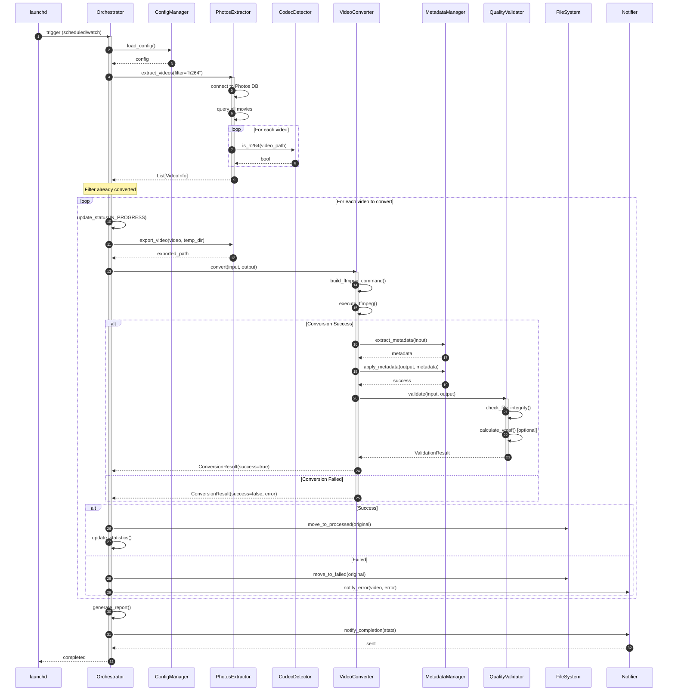
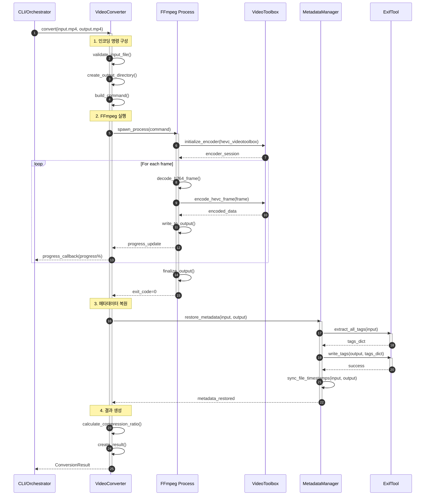
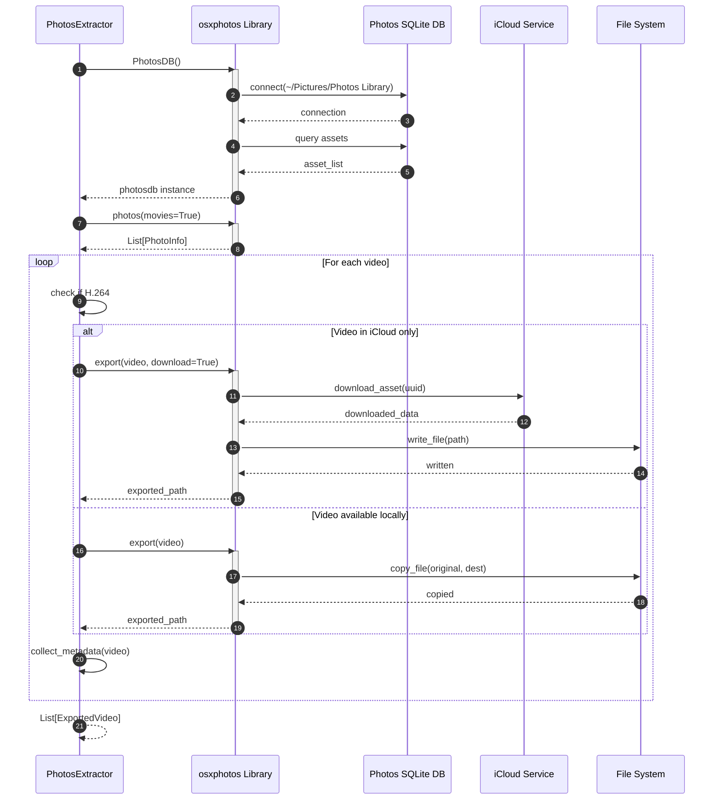
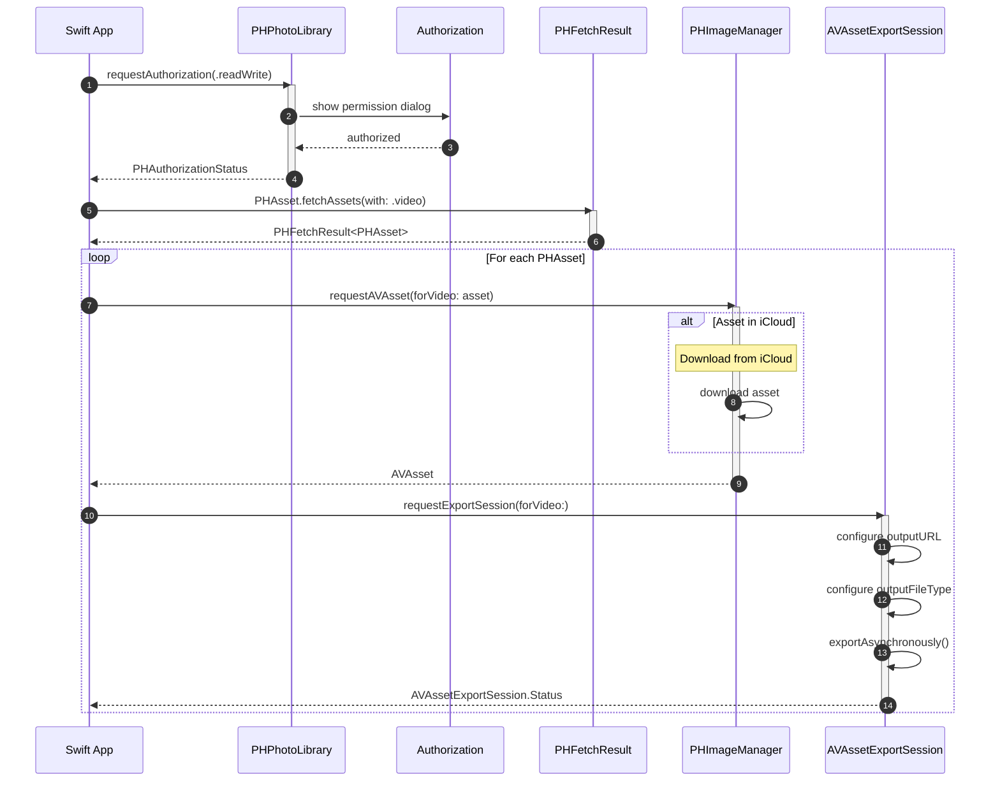
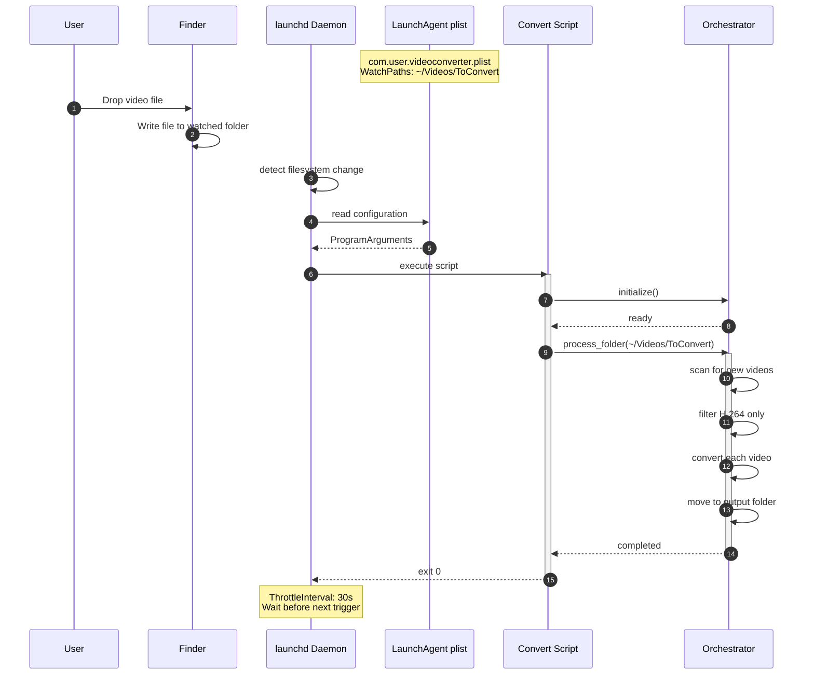
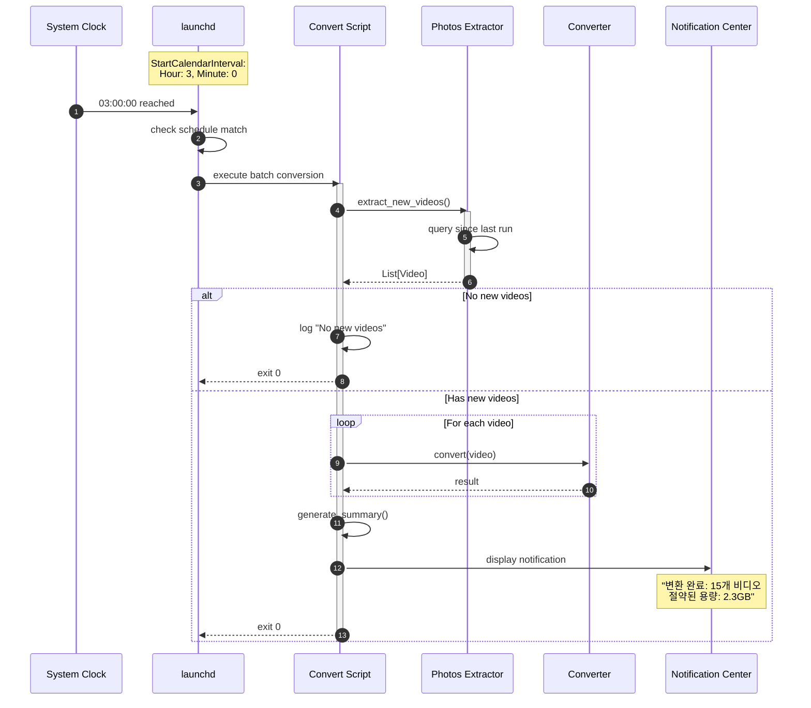
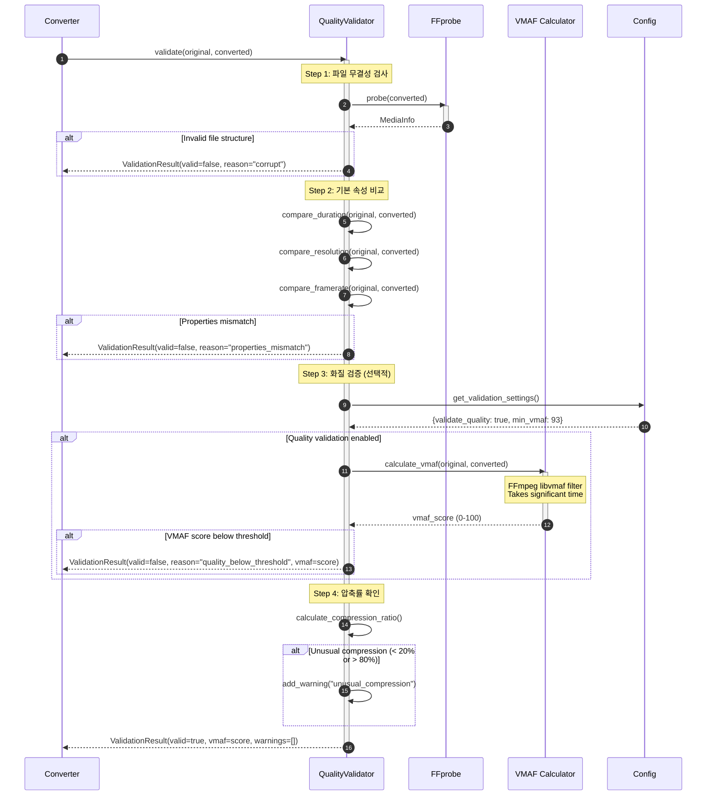
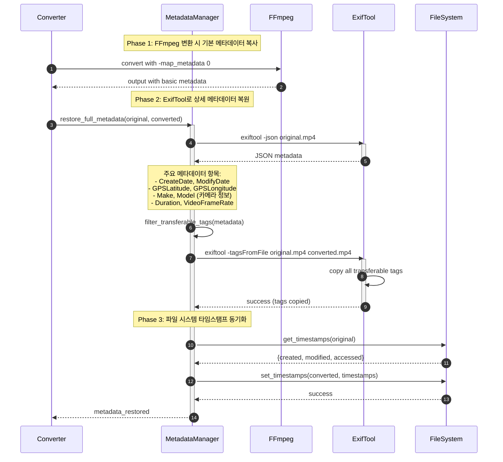
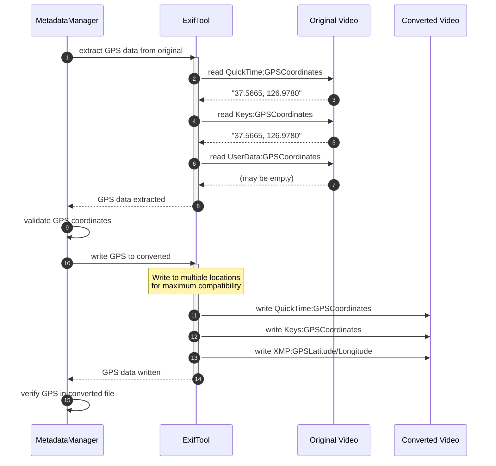
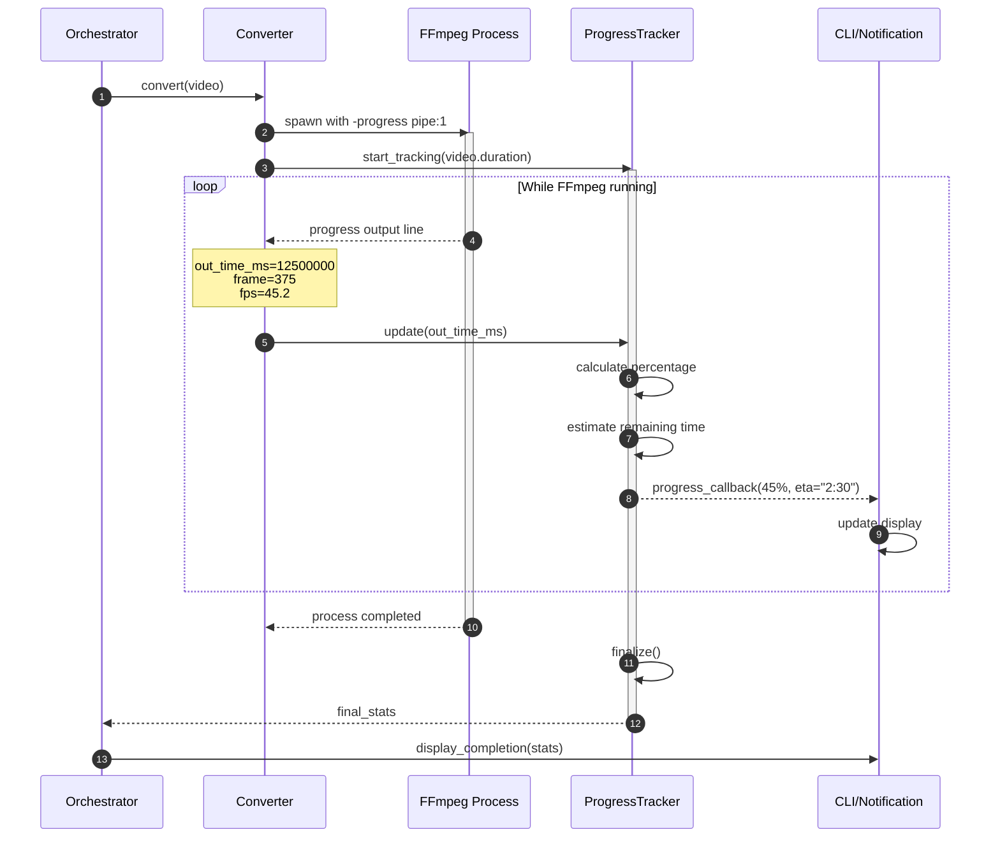

# 시퀀스 다이어그램

## 1. 메인 변환 워크플로우

### 1.1 전체 배치 변환 프로세스



### 1.2 단일 비디오 변환 상세



## 2. Photos 라이브러리 접근

### 2.1 osxphotos를 통한 비디오 추출



### 2.2 PhotoKit을 통한 비디오 접근 (Swift)



## 3. 자동화 트리거

### 3.1 launchd WatchPaths 트리거



### 3.2 스케줄 기반 실행 (StartCalendarInterval)



## 4. 에러 처리 및 복구

### 4.1 변환 실패 시 재시도 로직

```mermaid
sequenceDiagram
    autonumber
    participant ORCH as Orchestrator
    participant CONV as Converter
    participant FFMPEG as FFmpeg
    participant RETRY as RetryManager
    participant FAILED as FailedQueue
    participant LOG as Logger

    ORCH->>CONV: convert(video)
    activate CONV

    CONV->>FFMPEG: execute()
    activate FFMPEG

    alt FFmpeg Error (exit code != 0)
        FFMPEG-->>CONV: error (exit_code=1)
        deactivate FFMPEG

        CONV->>RETRY: should_retry(attempt=1)
        RETRY-->>CONV: true (max_retries=3)

        CONV->>LOG: log_warning("Attempt 1 failed, retrying...")

        Note over CONV: Wait with exponential backoff<br/>delay = 5 * attempt seconds
        CONV->>CONV: sleep(5)

        CONV->>FFMPEG: execute() [retry 2]
        activate FFMPEG
        FFMPEG-->>CONV: error
        deactivate FFMPEG

        CONV->>RETRY: should_retry(attempt=2)
        RETRY-->>CONV: true

        CONV->>CONV: sleep(10)

        CONV->>FFMPEG: execute() [retry 3]
        activate FFMPEG
        FFMPEG-->>CONV: error
        deactivate FFMPEG

        CONV->>RETRY: should_retry(attempt=3)
        RETRY-->>CONV: false (max reached)

        CONV->>FAILED: add_to_queue(video, error)
        CONV->>LOG: log_error("Conversion failed after 3 attempts")

        CONV-->>ORCH: ConversionResult(success=false)
    else FFmpeg Success
        FFMPEG-->>CONV: success (exit_code=0)
        deactivate FFMPEG
        CONV-->>ORCH: ConversionResult(success=true)
    end

    deactivate CONV
```

### 4.2 iCloud 다운로드 실패 처리

```mermaid
sequenceDiagram
    autonumber
    participant EXTRACT as Extractor
    participant OSXP as osxphotos
    participant ICLOUD as iCloud
    participant QUEUE as PendingQueue
    participant LOG as Logger

    EXTRACT->>OSXP: export(video, download=True)
    activate OSXP

    OSXP->>ICLOUD: request_download(asset_id)
    activate ICLOUD

    alt Network Error
        ICLOUD-->>OSXP: NetworkError
        deactivate ICLOUD

        OSXP-->>EXTRACT: ExportError("Network unavailable")

        EXTRACT->>QUEUE: add_pending(video, reason="network")
        EXTRACT->>LOG: log_info("Video queued for later: network issue")

    else Timeout
        ICLOUD-->>OSXP: TimeoutError
        deactivate ICLOUD

        OSXP-->>EXTRACT: ExportError("Download timeout")

        EXTRACT->>QUEUE: add_pending(video, reason="timeout")
        EXTRACT->>LOG: log_warning("Video queued: download timeout")

    else iCloud Quota Exceeded
        ICLOUD-->>OSXP: QuotaExceededError

        OSXP-->>EXTRACT: ExportError("iCloud quota exceeded")

        EXTRACT->>LOG: log_error("Cannot download: quota exceeded")
        Note over EXTRACT: Skip this video entirely

    else Success
        ICLOUD-->>OSXP: downloaded_data
        OSXP->>OSXP: write_to_disk()
        OSXP-->>EXTRACT: exported_path
    end

    deactivate OSXP
```

## 5. 품질 검증 프로세스

### 5.1 변환 후 품질 검증



## 6. 메타데이터 처리 상세

### 6.1 메타데이터 추출 및 복원



### 6.2 GPS 및 위치 정보 보존



## 7. 진행 상황 모니터링

### 7.1 실시간 진행률 추적


