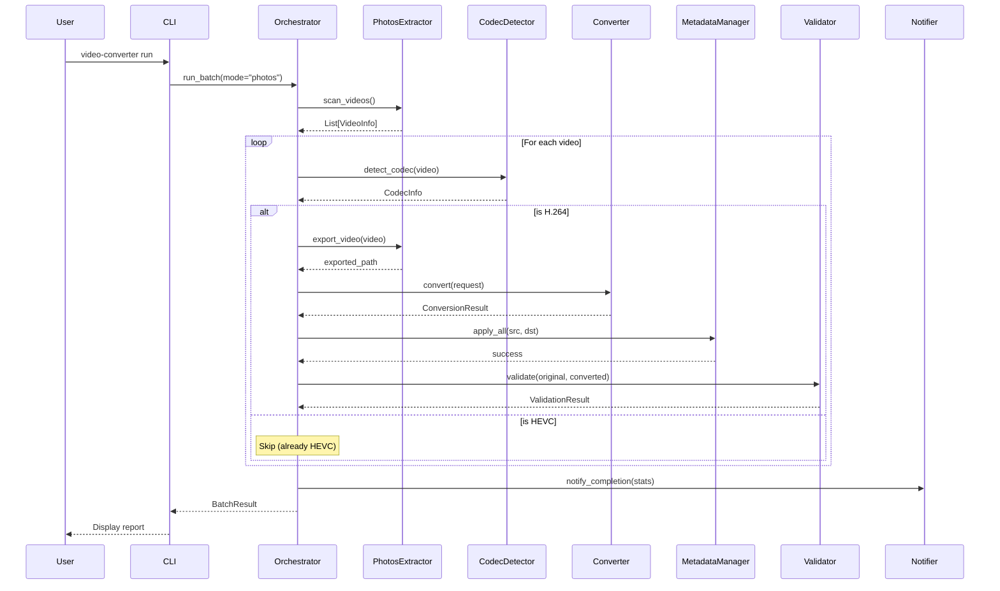
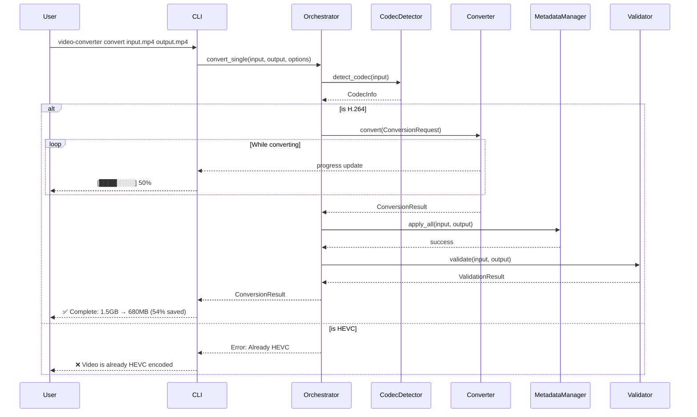
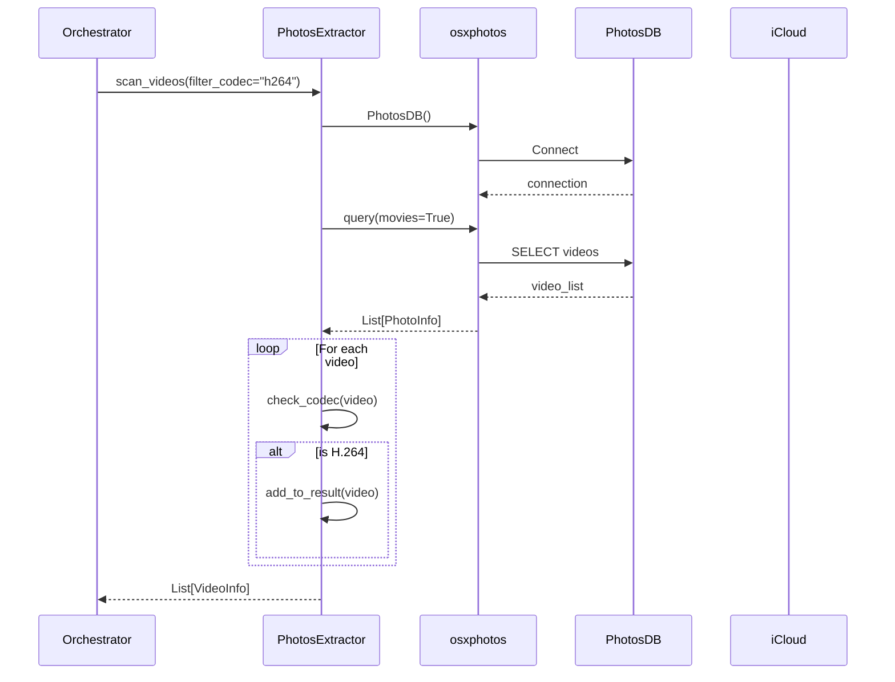
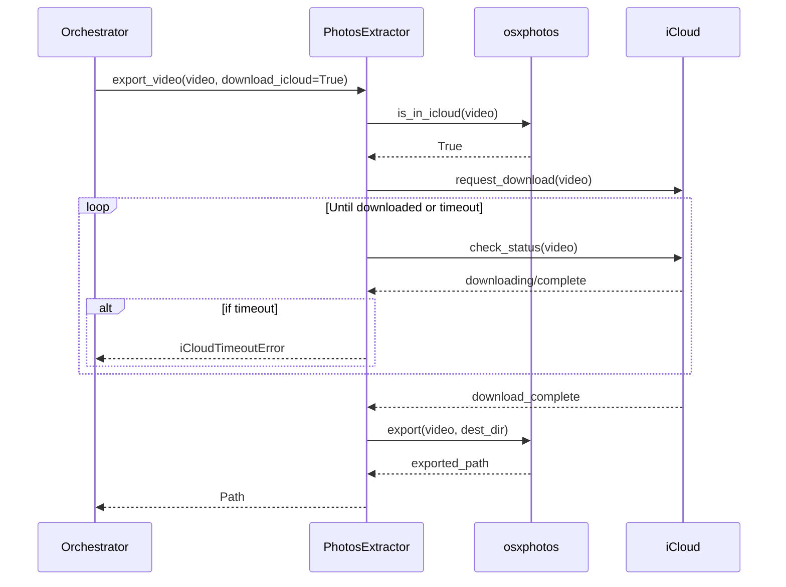
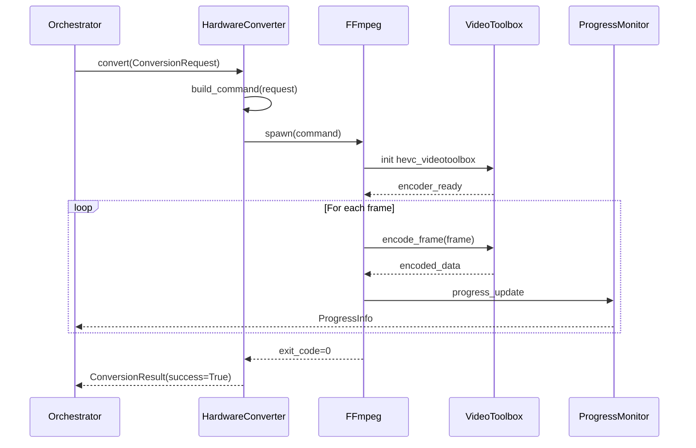
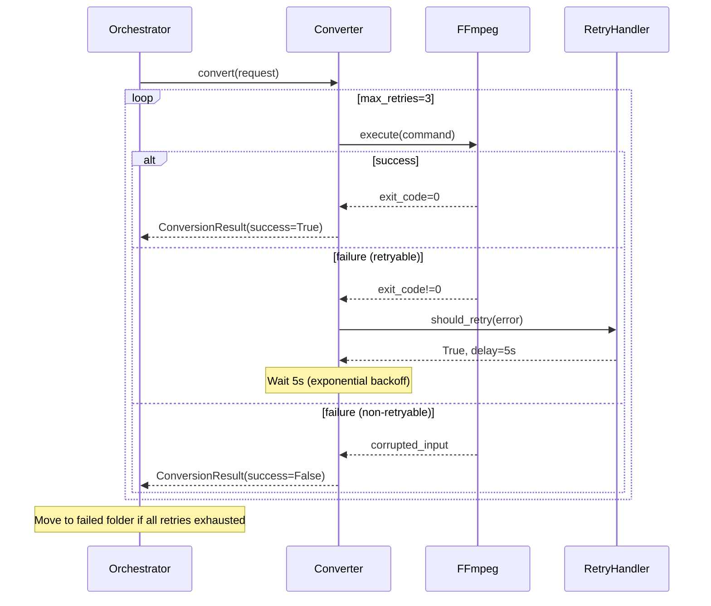
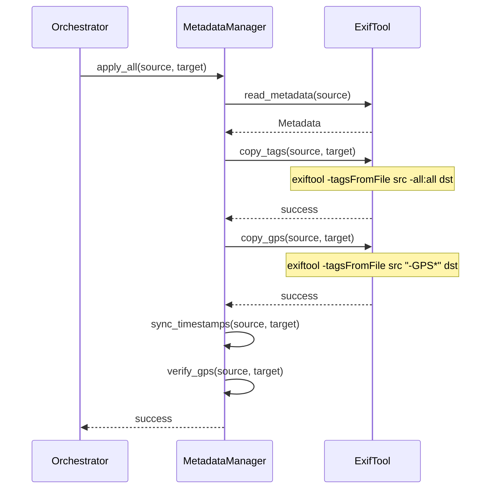
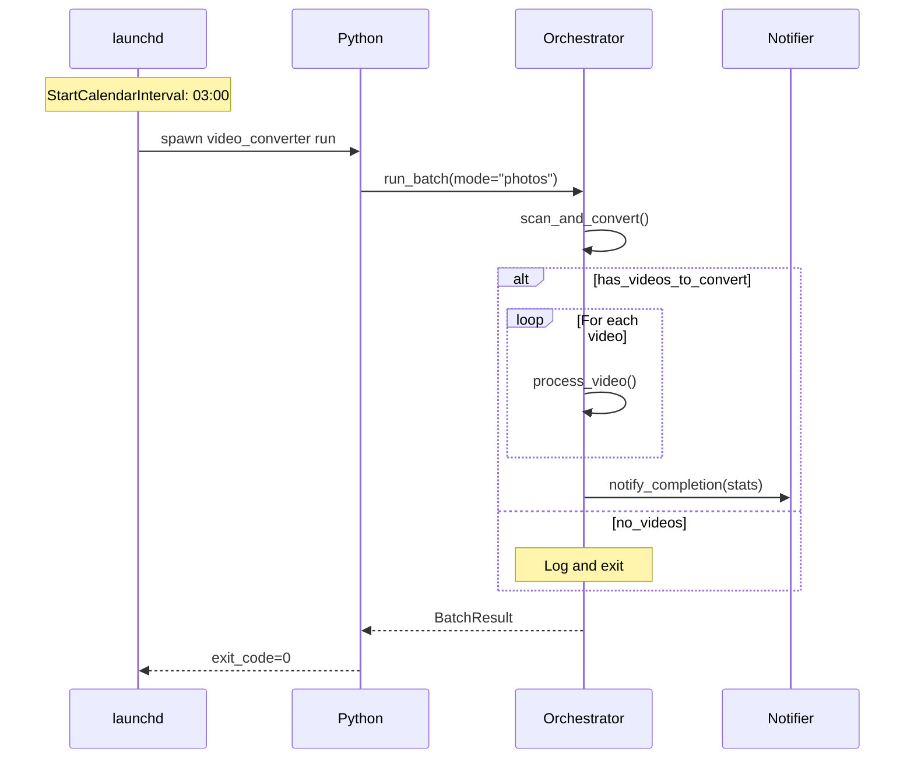
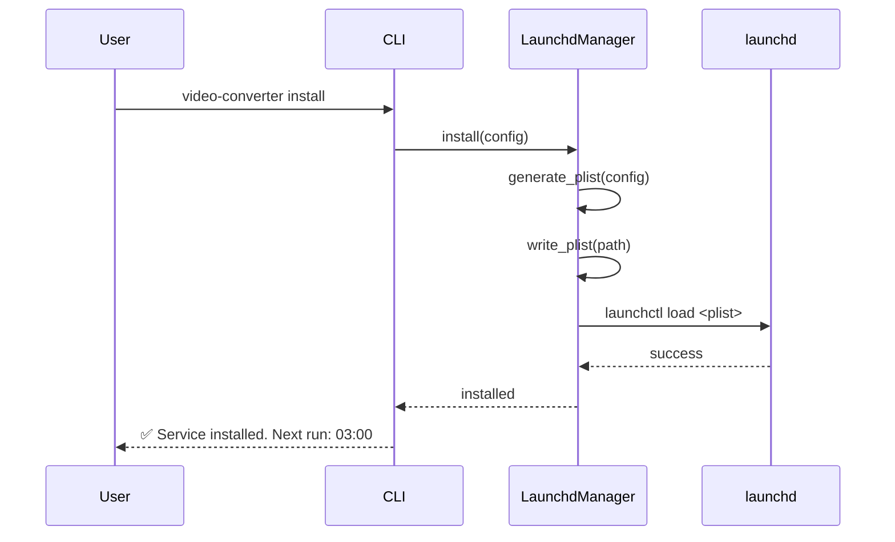
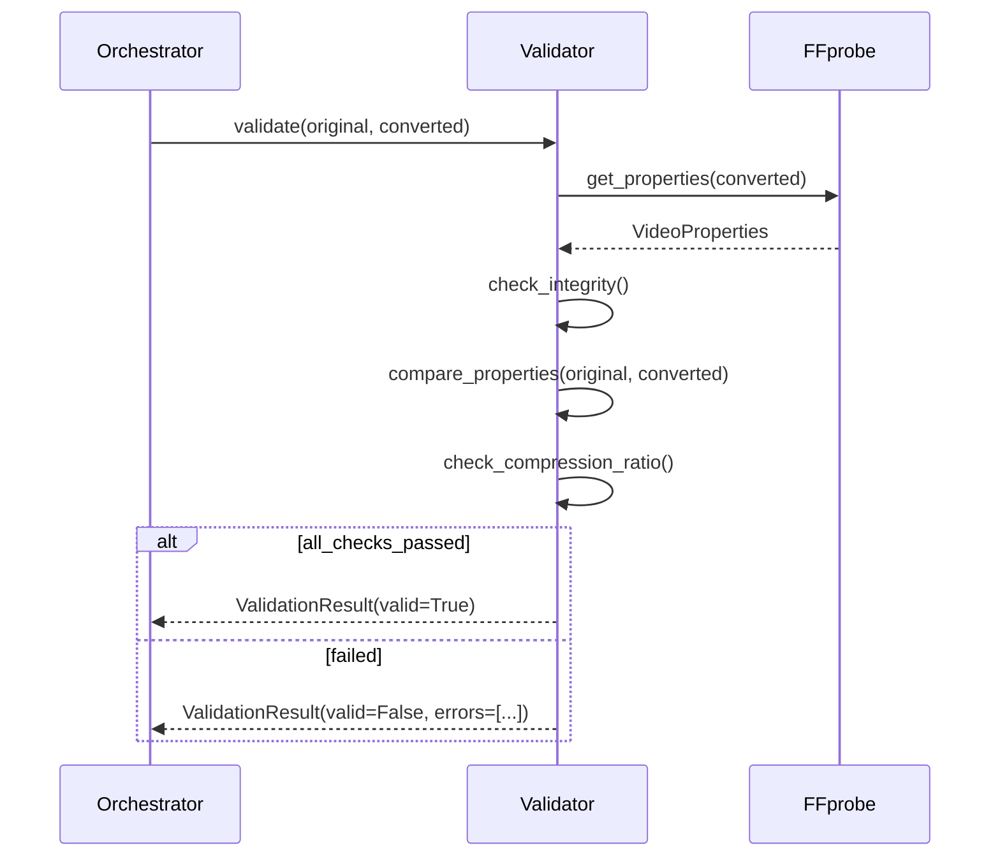

# Sequence Diagrams

## 1. Batch Conversion Workflow

### 1.1 Overall Flow

### 1.2 Single File Conversion

## 2. Photos Library Access

### 2.1 Video Extraction

### 2.2 iCloud Download

## 3. Conversion Process

### 3.1 Hardware Conversion (VideoToolbox)

### 3.2 Error Recovery

## 4. Metadata Processing

### 4.1 Metadata Copy

## 5. Automation

### 5.1 Scheduled Execution

### 5.2 Service Management

## 6. Quality Validation

### 6.1 Validation Flow

