# 데이터 흐름 및 상태 다이어그램

## 1. 데이터 흐름 다이어그램 (DFD)

### 1.1 Context Diagram (Level 0)

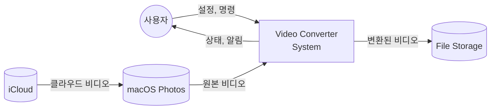

### 1.2 Level 1 DFD

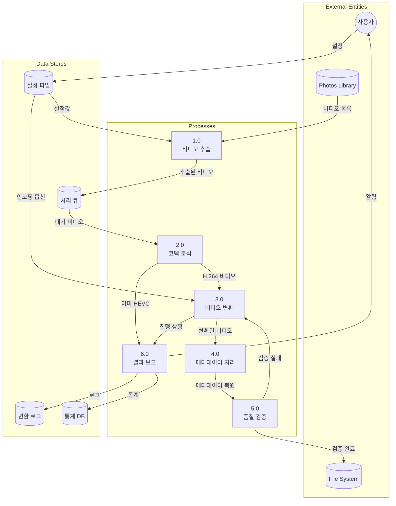

### 1.3 Level 2 DFD - 비디오 변환 프로세스 상세

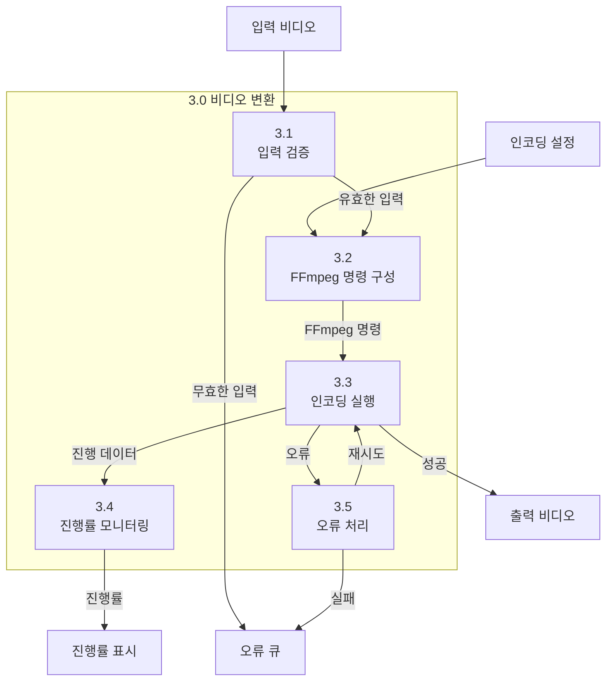

## 2. 데이터 변환 흐름

### 2.1 비디오 파일 변환 경로

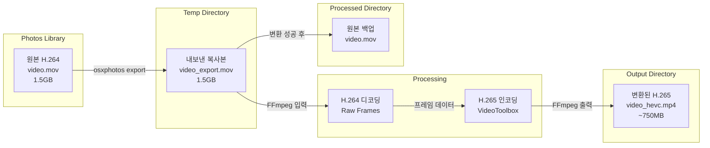

### 2.2 메타데이터 흐름

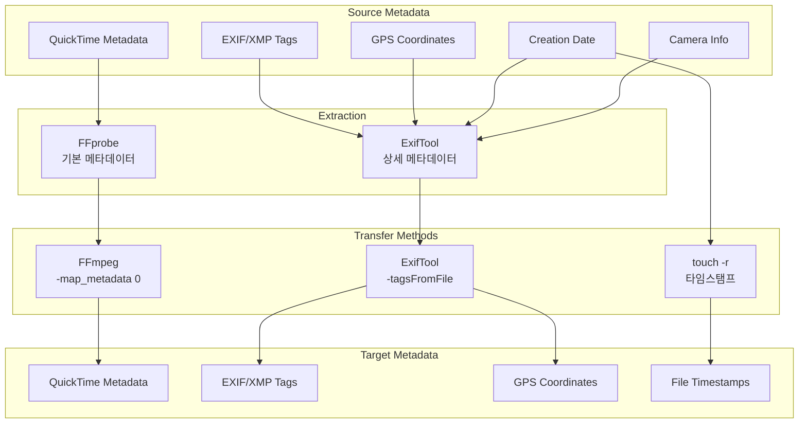

## 3. 상태 다이어그램

### 3.1 비디오 처리 상태

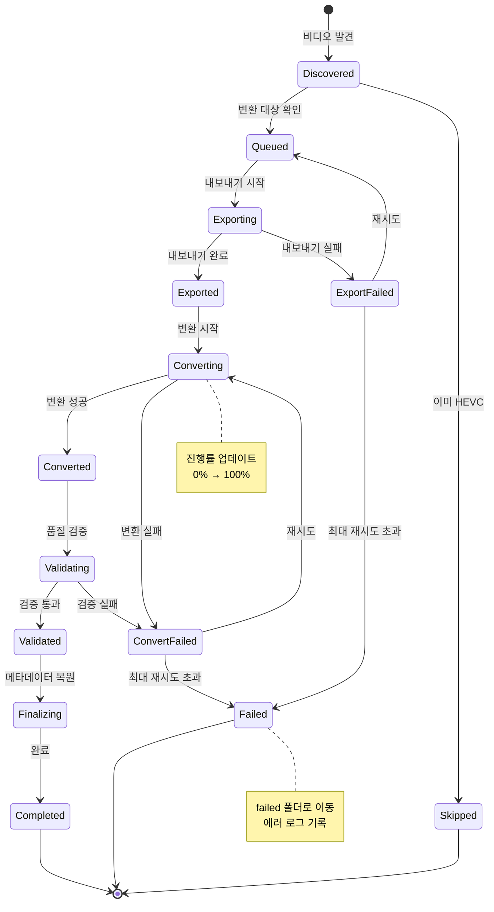

### 3.2 시스템 운영 상태

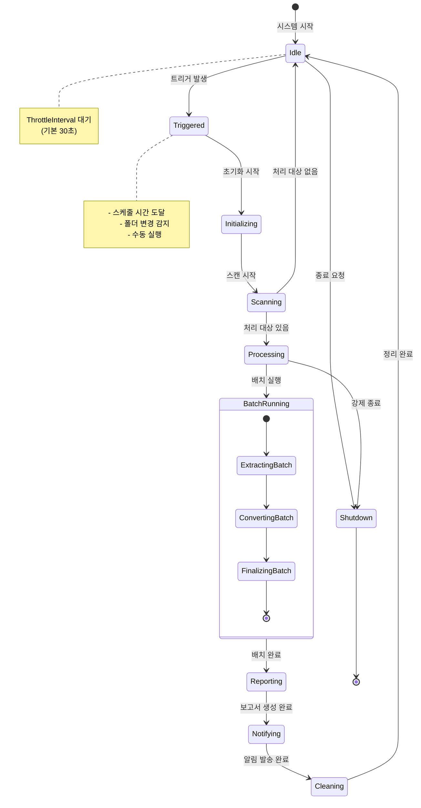

### 3.3 FFmpeg 프로세스 상태

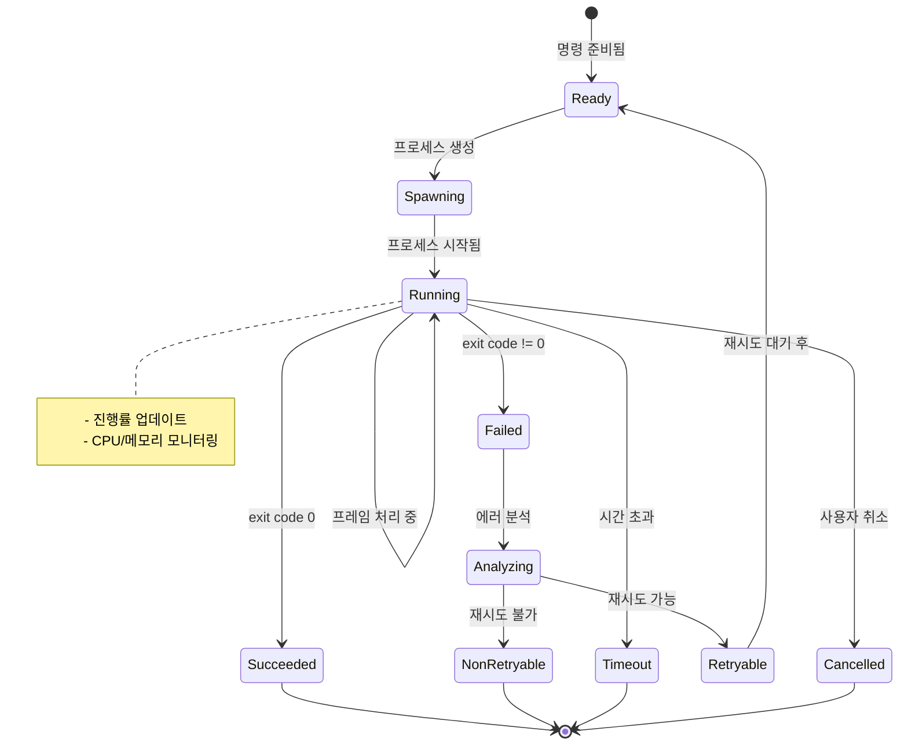

## 4. 처리 큐 관리

### 4.1 큐 상태 전이

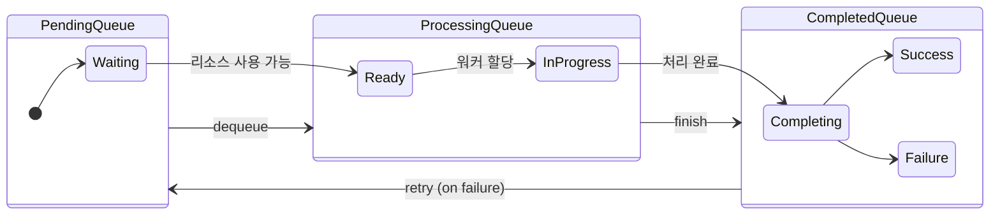

### 4.2 동시 처리 관리

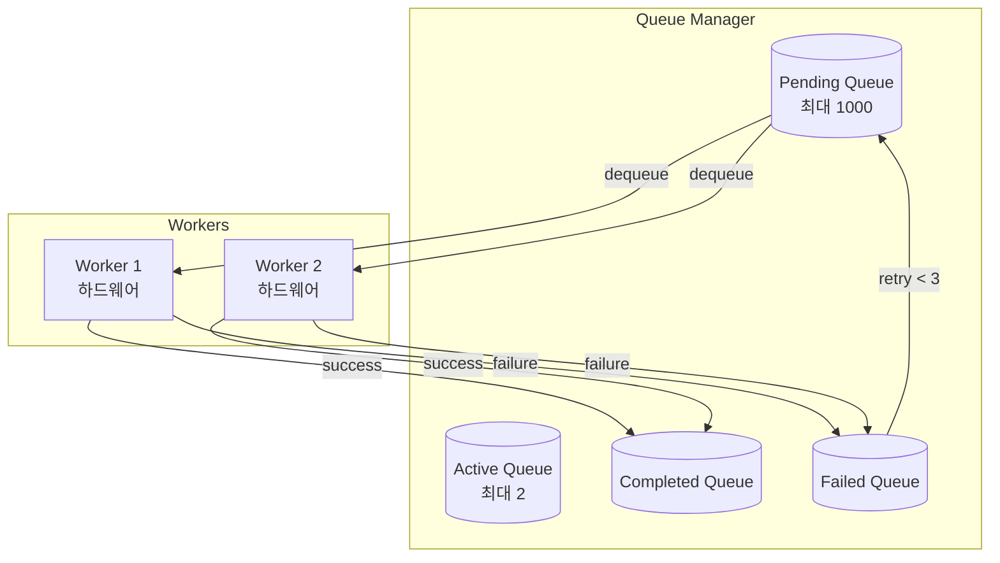

## 5. 에러 상태 및 복구

### 5.1 에러 분류 및 처리

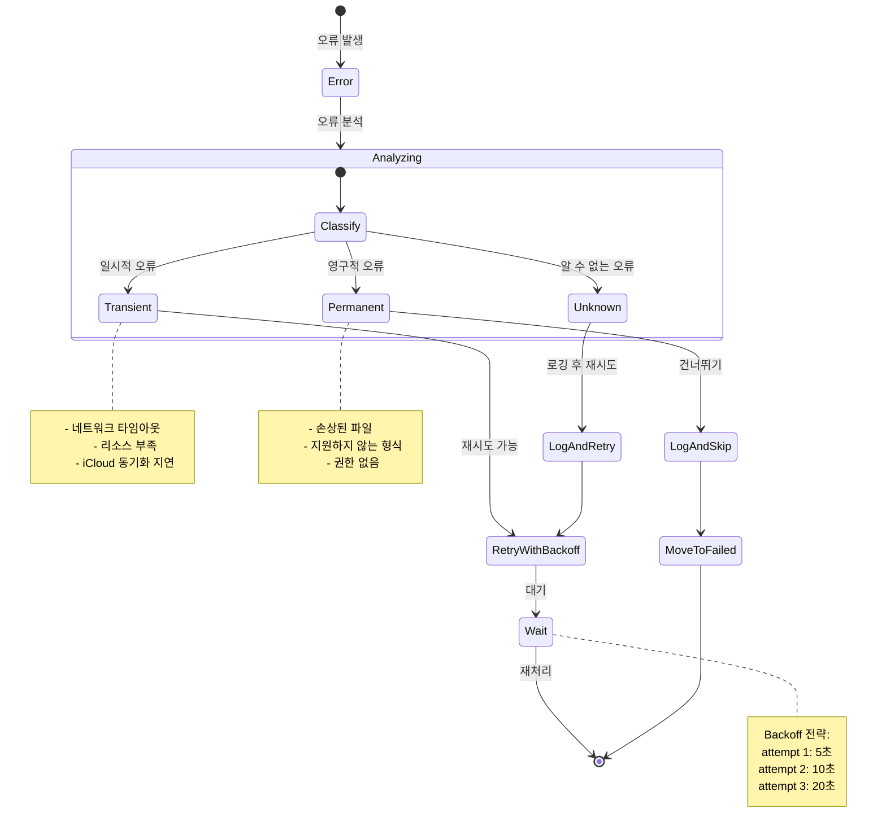

### 5.2 복구 워크플로우

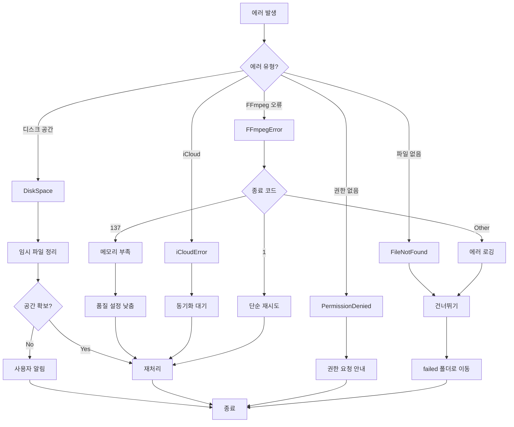

## 6. 설정 데이터 구조

### 6.1 설정 계층 구조

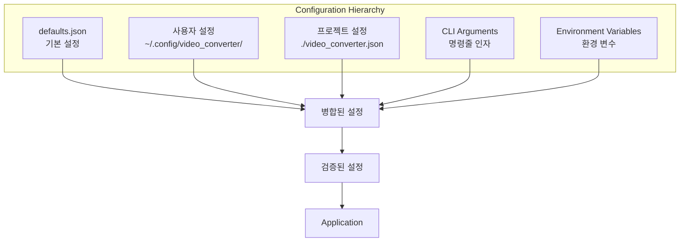

**우선순위**: CLI > ENV > PROJECT > USER > DEFAULT

### 6.2 런타임 상태 저장

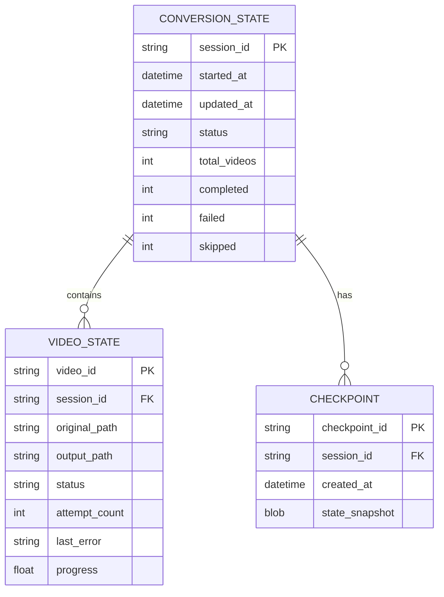

## 7. 로깅 데이터 흐름

### 7.1 로그 수집 및 저장

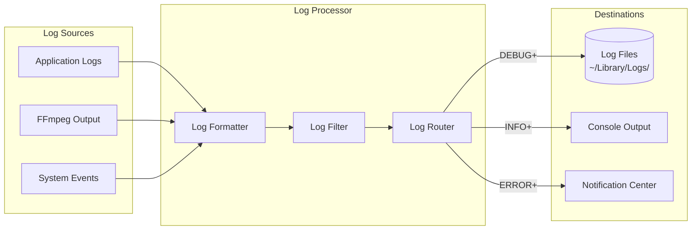
