# Data Flow and State Diagrams

## 1. Data Flow Diagrams (DFD)

### 1.1 Context Diagram (Level 0)

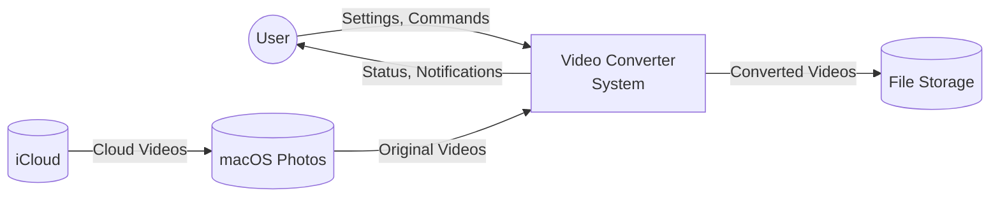

### 1.2 Level 1 DFD

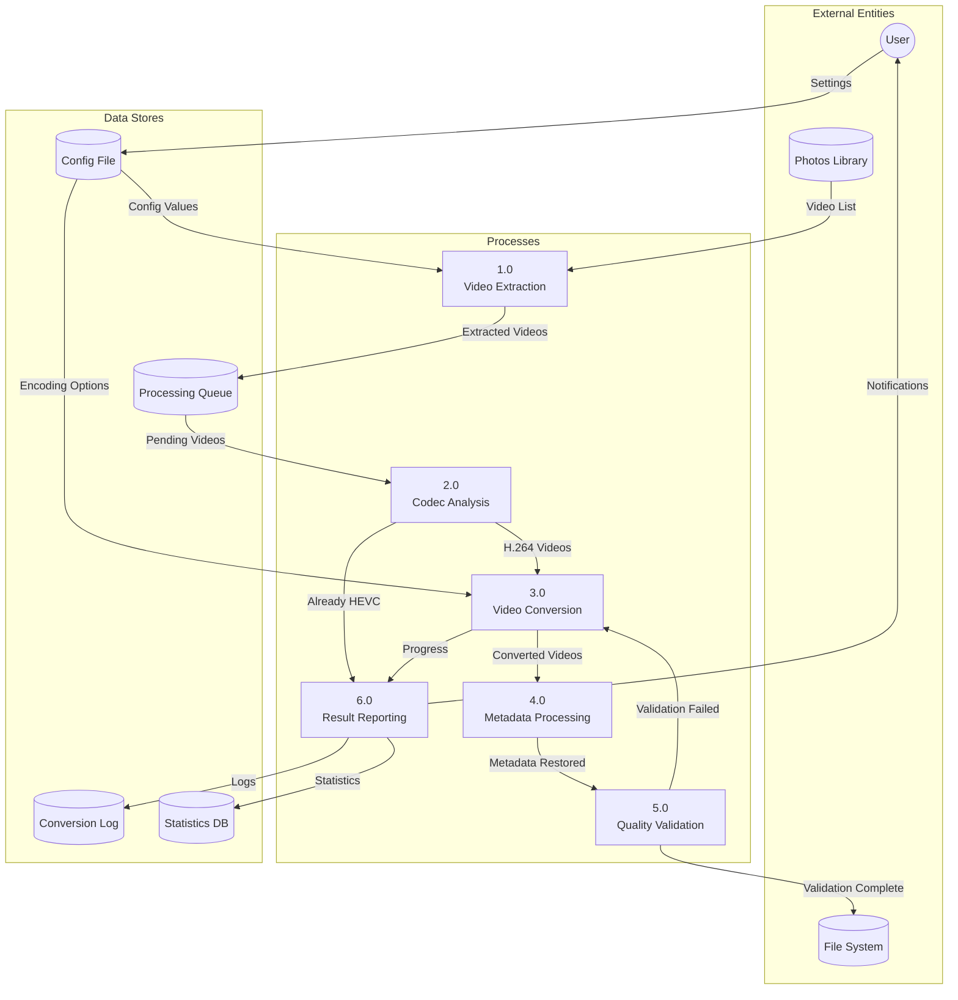

### 1.3 Level 2 DFD - Video Conversion Process Details

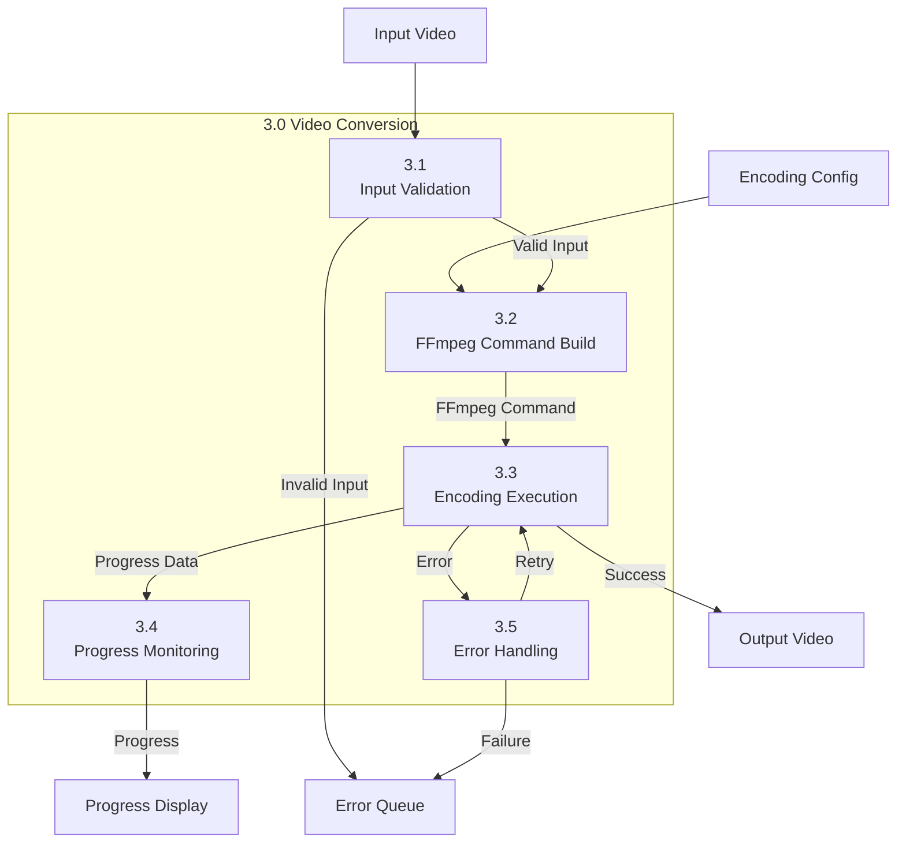

## 2. Data Transformation Flow

### 2.1 Video File Conversion Path

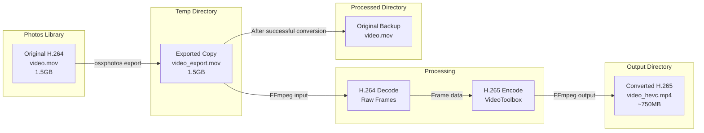

### 2.2 Metadata Flow

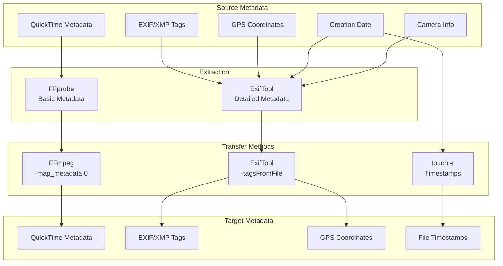

## 3. State Diagrams

### 3.1 Video Processing States

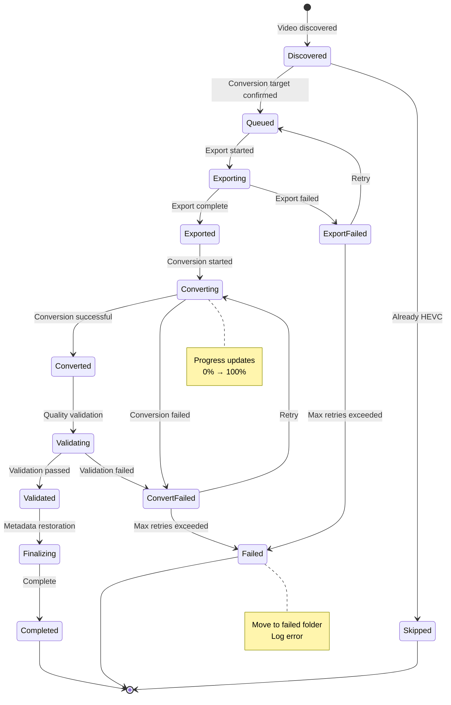

### 3.2 System Operation States

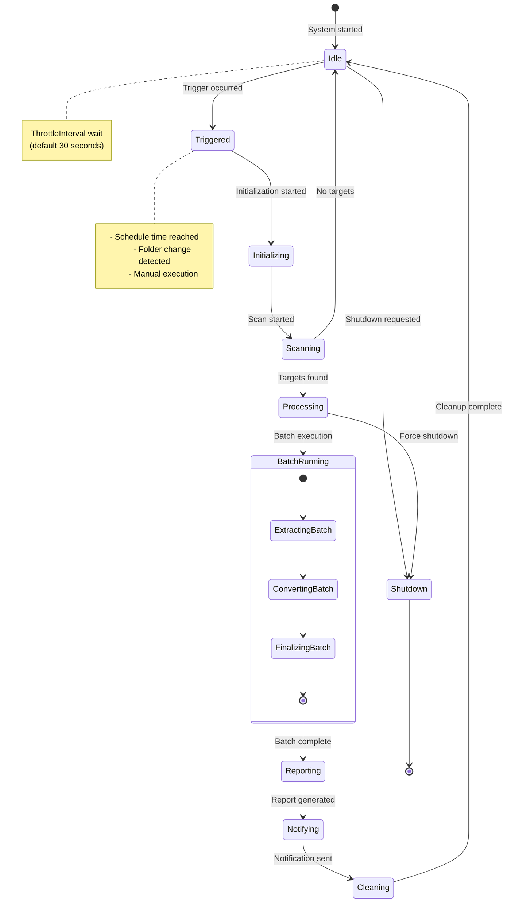

### 3.3 FFmpeg Process States

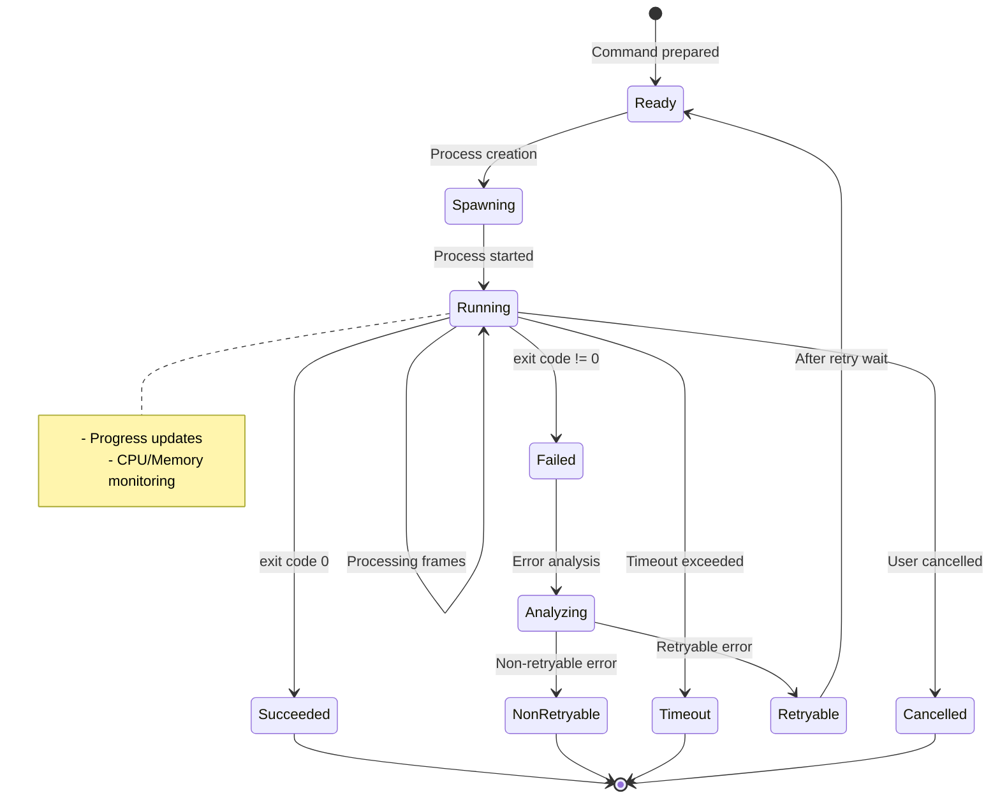

## 4. Processing Queue Management

### 4.1 Queue State Transitions

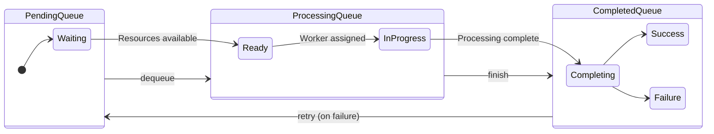

### 4.2 Concurrent Processing Management

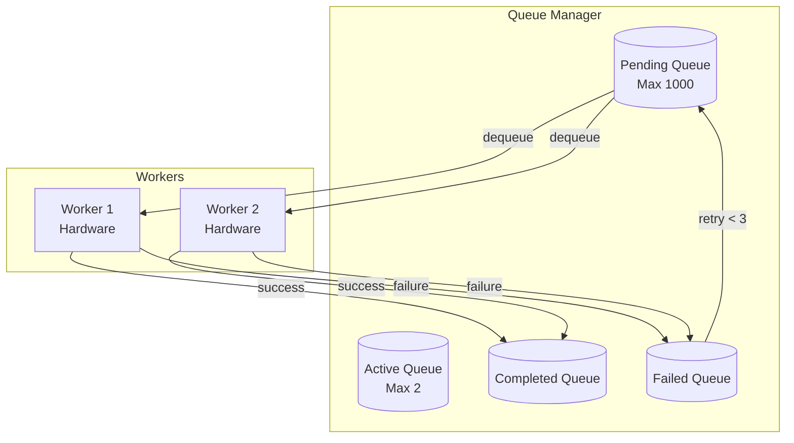

## 5. Error States and Recovery

### 5.1 Error Classification and Handling

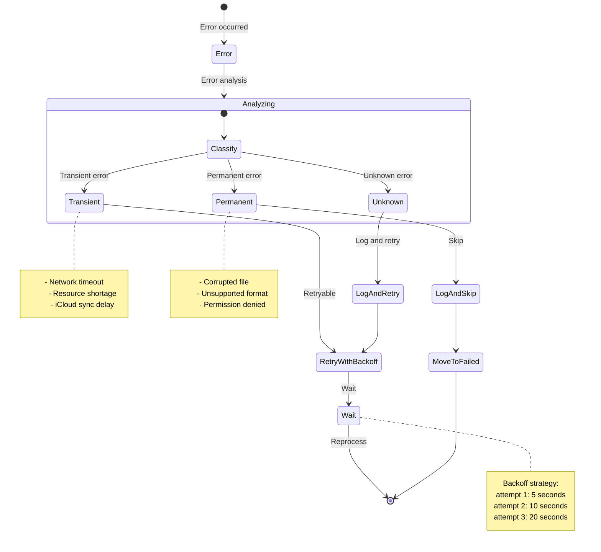

### 5.2 Recovery Workflow

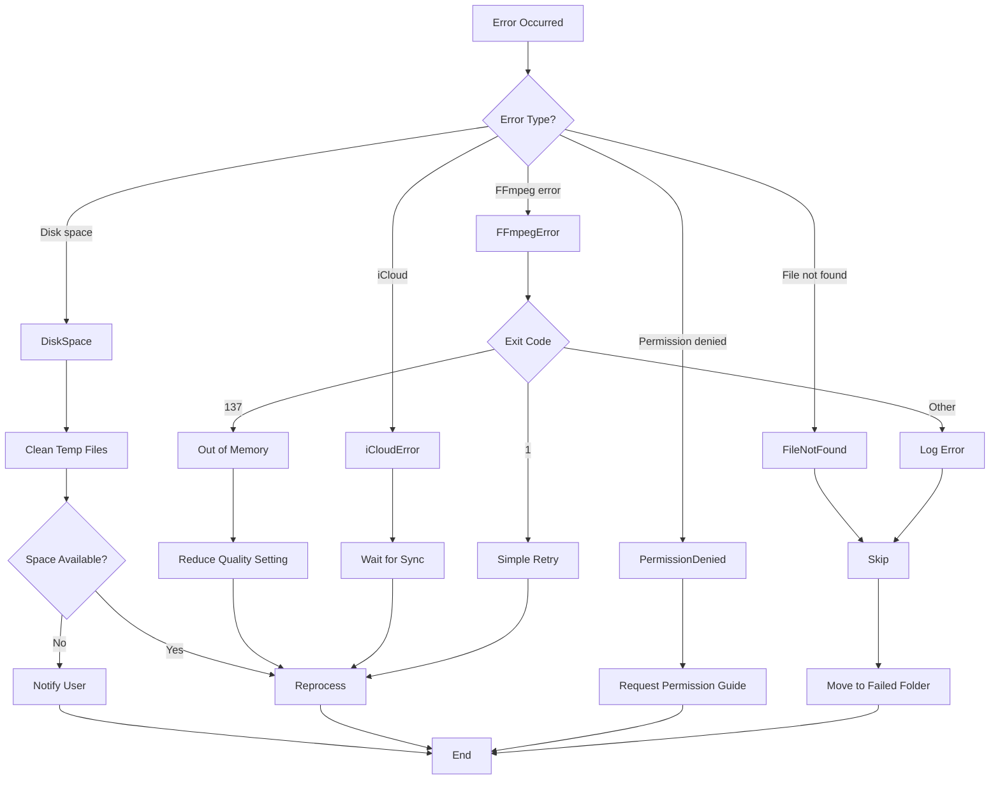

## 6. Configuration Data Structure

### 6.1 Configuration Hierarchy

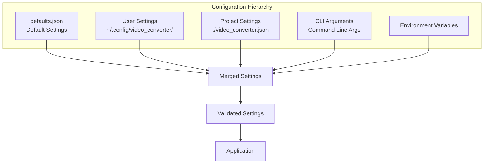

**Priority**: CLI > ENV > PROJECT > USER > DEFAULT

### 6.2 Runtime State Storage

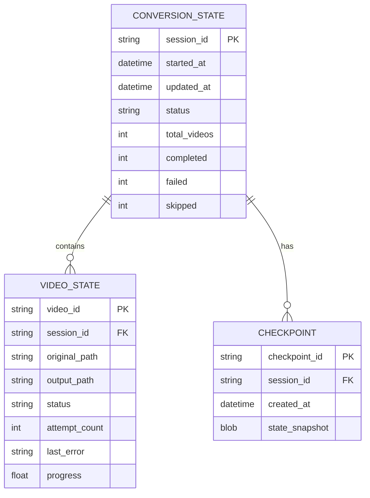

## 7. Logging Data Flow

### 7.1 Log Collection and Storage

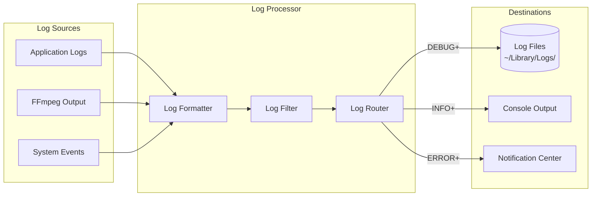
