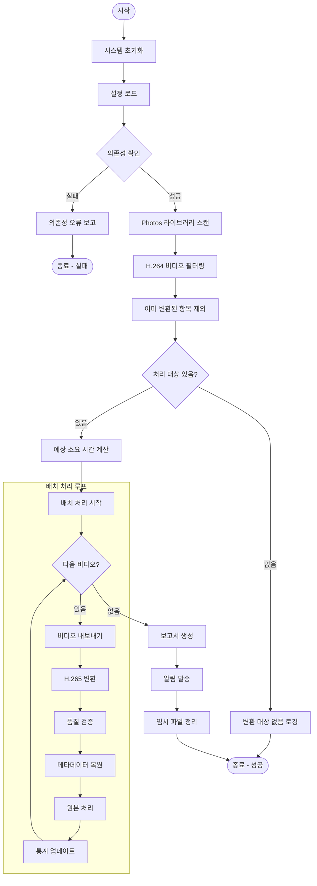
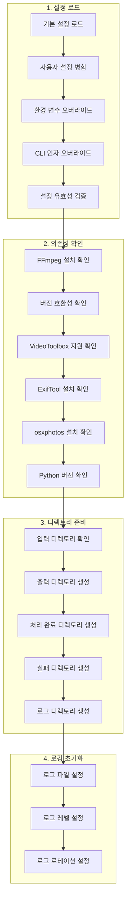
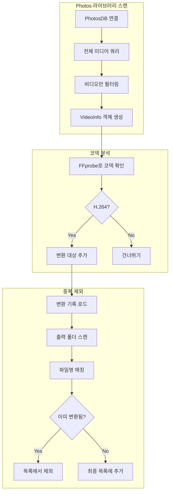
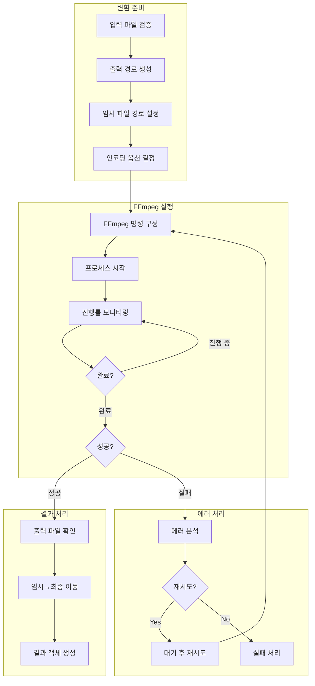
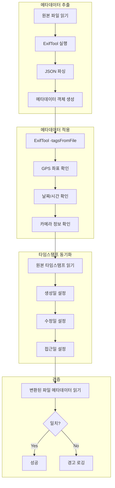
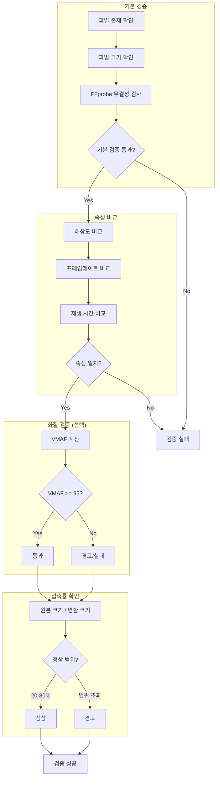
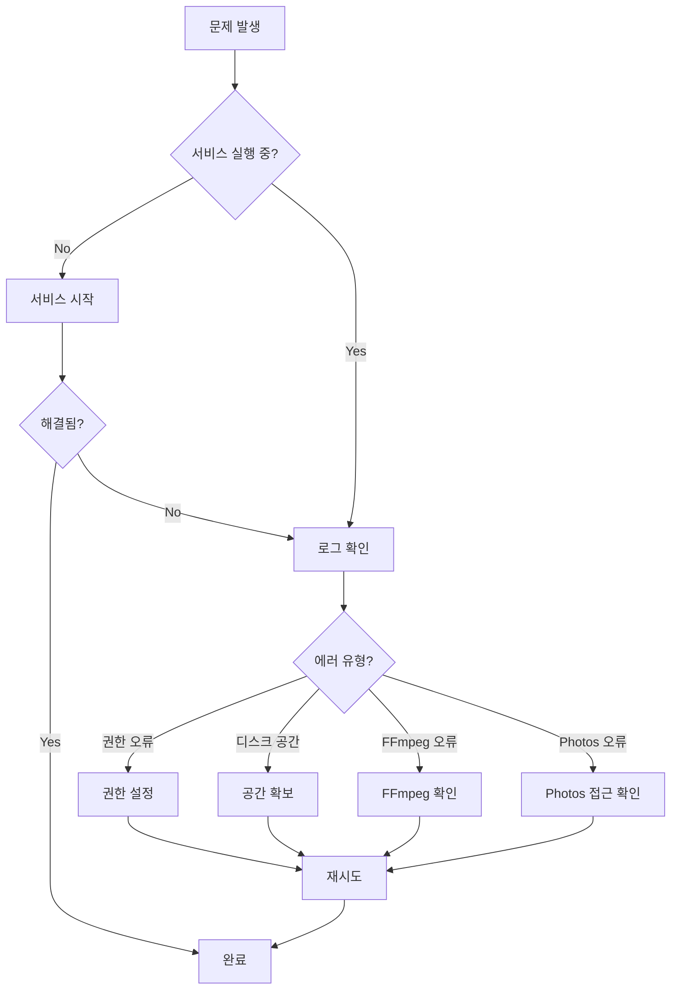
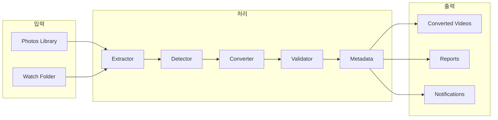

# 처리 절차 정의서

## 1. 전체 처리 절차 개요

### 1.1 메인 워크플로우



### 1.2 처리 단계별 상세

```
┌─────────────────────────────────────────────────────────────────────────┐
│                        처리 절차 요약                                      │
├─────────┬───────────────────────────────────────────────────────────────┤
│ 단계    │ 설명                                                           │
├─────────┼───────────────────────────────────────────────────────────────┤
│ 1. 초기화 │ 설정 로드, 의존성 확인, 디렉토리 생성                            │
│ 2. 스캔   │ Photos 라이브러리에서 비디오 목록 수집                           │
│ 3. 필터링 │ H.264 코덱만 선택, 이미 변환된 항목 제외                         │
│ 4. 추출   │ Photos에서 임시 디렉토리로 원본 내보내기                         │
│ 5. 변환   │ FFmpeg으로 H.265 인코딩 실행                                   │
│ 6. 검증   │ 출력 파일 무결성 및 품질 확인                                   │
│ 7. 메타데이터│ GPS, 날짜 등 메타데이터 복원                                  │
│ 8. 정리   │ 원본 이동/삭제, 통계 기록, 알림                                │
└─────────┴───────────────────────────────────────────────────────────────┘
```

## 2. 단계별 상세 절차

### 2.1 시스템 초기화 절차



#### 의존성 확인 스크립트

```bash
#!/bin/bash
# check_dependencies.sh

check_command() {
    if ! command -v "$1" &> /dev/null; then
        echo "ERROR: $1 is not installed"
        return 1
    fi
    echo "OK: $1 found at $(which $1)"
    return 0
}

check_ffmpeg_hevc() {
    if ffmpeg -encoders 2>/dev/null | grep -q hevc_videotoolbox; then
        echo "OK: hevc_videotoolbox encoder available"
        return 0
    fi
    echo "ERROR: hevc_videotoolbox not available"
    return 1
}

echo "=== Checking Dependencies ==="

check_command ffmpeg
check_command ffprobe
check_command exiftool
check_command python3

python3 -c "import osxphotos" 2>/dev/null
if [ $? -eq 0 ]; then
    echo "OK: osxphotos module available"
else
    echo "ERROR: osxphotos module not installed"
fi

check_ffmpeg_hevc

echo "=== Dependency Check Complete ==="
```

### 2.2 비디오 스캔 및 필터링 절차



#### 코덱 확인 함수

```python
def detect_codec(video_path: Path) -> str:
    """FFprobe를 사용하여 비디오 코덱 감지"""
    cmd = [
        'ffprobe',
        '-v', 'error',
        '-select_streams', 'v:0',
        '-show_entries', 'stream=codec_name',
        '-of', 'default=noprint_wrappers=1:nokey=1',
        str(video_path)
    ]

    result = subprocess.run(cmd, capture_output=True, text=True)
    return result.stdout.strip().lower()


def is_h264(video_path: Path) -> bool:
    """H.264 코덱 여부 확인"""
    codec = detect_codec(video_path)
    return codec in ('h264', 'avc', 'avc1')


def is_already_hevc(video_path: Path) -> bool:
    """이미 HEVC 코덱인지 확인"""
    codec = detect_codec(video_path)
    return codec in ('hevc', 'h265', 'hvc1', 'hev1')
```

### 2.3 비디오 변환 절차



#### FFmpeg 명령 구성

```python
def build_ffmpeg_command(
    input_path: Path,
    output_path: Path,
    config: EncodingConfig
) -> List[str]:
    """인코딩 설정에 따른 FFmpeg 명령 구성"""

    cmd = ['ffmpeg', '-y', '-i', str(input_path)]

    if config.mode == 'hardware':
        # VideoToolbox 하드웨어 인코딩
        cmd.extend([
            '-c:v', 'hevc_videotoolbox',
            '-q:v', str(config.quality),  # 1-100
            '-tag:v', 'hvc1',  # QuickTime 호환성
        ])
    else:
        # libx265 소프트웨어 인코딩
        cmd.extend([
            '-c:v', 'libx265',
            '-crf', str(config.crf),  # 0-51
            '-preset', config.preset,
        ])

    # 공통 옵션
    cmd.extend([
        '-c:a', 'copy',           # 오디오 스트림 복사
        '-map_metadata', '0',      # 메타데이터 복사
        '-movflags', 'use_metadata_tags',
        '-progress', 'pipe:1',     # 진행률 출력
        str(output_path)
    ])

    return cmd
```

### 2.4 메타데이터 복원 절차



#### 메타데이터 복원 스크립트

```bash
#!/bin/bash
# restore_metadata.sh

ORIGINAL="$1"
CONVERTED="$2"

echo "Restoring metadata from $ORIGINAL to $CONVERTED"

# 1. ExifTool로 모든 태그 복사
exiftool -overwrite_original \
    -tagsFromFile "$ORIGINAL" \
    -all:all \
    "$CONVERTED"

# 2. GPS 정보 명시적 복사 (일부 포맷에서 누락될 수 있음)
exiftool -overwrite_original \
    -tagsFromFile "$ORIGINAL" \
    "-GPS*" \
    "$CONVERTED"

# 3. 파일 타임스탬프 동기화
touch -r "$ORIGINAL" "$CONVERTED"

# 4. 결과 확인
echo "=== Original Metadata ==="
exiftool -CreateDate -GPSLatitude -GPSLongitude "$ORIGINAL"

echo "=== Converted Metadata ==="
exiftool -CreateDate -GPSLatitude -GPSLongitude "$CONVERTED"
```

### 2.5 품질 검증 절차



#### 품질 검증 함수

```python
def validate_conversion(
    original: Path,
    converted: Path,
    config: ValidationConfig
) -> ValidationResult:
    """변환 결과 검증"""

    errors = []
    warnings = []

    # 1. 파일 존재 및 크기 확인
    if not converted.exists():
        return ValidationResult(valid=False, errors=["Output file not found"])

    if converted.stat().st_size == 0:
        return ValidationResult(valid=False, errors=["Output file is empty"])

    # 2. FFprobe 무결성 검사
    probe_result = run_ffprobe(converted)
    if probe_result.get('error'):
        return ValidationResult(valid=False, errors=["File integrity check failed"])

    # 3. 속성 비교
    orig_info = get_video_info(original)
    conv_info = get_video_info(converted)

    if abs(orig_info.duration - conv_info.duration) > 1.0:
        errors.append(f"Duration mismatch: {orig_info.duration} vs {conv_info.duration}")

    if orig_info.resolution != conv_info.resolution:
        errors.append(f"Resolution mismatch: {orig_info.resolution} vs {conv_info.resolution}")

    # 4. 압축률 확인
    compression = converted.stat().st_size / original.stat().st_size
    if compression < 0.2 or compression > 0.8:
        warnings.append(f"Unusual compression ratio: {compression:.2%}")

    # 5. VMAF 계산 (설정된 경우)
    vmaf_score = None
    if config.validate_quality:
        vmaf_score = calculate_vmaf(original, converted)
        if vmaf_score < config.min_vmaf:
            errors.append(f"VMAF score too low: {vmaf_score}")

    return ValidationResult(
        valid=len(errors) == 0,
        errors=errors,
        warnings=warnings,
        vmaf_score=vmaf_score,
        compression_ratio=compression
    )
```

## 3. 자동화 절차

### 3.1 launchd 서비스 설정 절차

```mermaid
flowchart TB
    subgraph "설치"
        I1[plist 파일 생성] --> I2[LaunchAgents 디렉토리에 복사]
        I2 --> I3[launchctl load 실행]
        I3 --> I4[서비스 상태 확인]
    end

    subgraph "실행 흐름"
        R1[트리거 발생] --> R2[launchd가 스크립트 실행]
        R2 --> R3[스크립트 완료]
        R3 --> R4[ThrottleInterval 대기]
        R4 --> R1
    end

    subgraph "모니터링"
        M1[launchctl list로 상태 확인] --> M2[로그 파일 확인]
        M2 --> M3[시스템 로그 확인]
    end

    subgraph "제거"
        U1[launchctl unload] --> U2[plist 파일 삭제]
        U2 --> U3[로그 정리]
    end
```



### 3.2 완전한 설치 스크립트

```bash
#!/bin/bash
# install.sh - Video Converter 설치 스크립트

set -e

SCRIPT_DIR="$(cd "$(dirname "$0")" && pwd)"
INSTALL_DIR="$HOME/.local/bin/video_converter"
CONFIG_DIR="$HOME/.config/video_converter"
LAUNCH_AGENTS="$HOME/Library/LaunchAgents"
PLIST_NAME="com.user.videoconverter.plist"

echo "=== Video Converter 설치 ==="

# 1. 의존성 설치
echo "1. 의존성 설치 중..."
if ! command -v brew &> /dev/null; then
    echo "Homebrew가 필요합니다. 설치해주세요."
    exit 1
fi

brew install ffmpeg exiftool python@3.12

# 2. Python 패키지 설치
echo "2. Python 패키지 설치 중..."
pip3 install osxphotos

# 3. 애플리케이션 설치
echo "3. 애플리케이션 설치 중..."
mkdir -p "$INSTALL_DIR"
cp -r "$SCRIPT_DIR/src/"* "$INSTALL_DIR/"
chmod +x "$INSTALL_DIR/"*.sh

# 4. 설정 파일 생성
echo "4. 설정 파일 생성 중..."
mkdir -p "$CONFIG_DIR"
if [ ! -f "$CONFIG_DIR/config.json" ]; then
    cat > "$CONFIG_DIR/config.json" << 'EOF'
{
  "version": "1.0.0",
  "encoding": {
    "mode": "hardware",
    "quality": 45
  },
  "paths": {
    "output": "~/Videos/Converted",
    "processed": "~/Videos/Processed",
    "failed": "~/Videos/Failed"
  },
  "automation": {
    "schedule": "daily",
    "time": "03:00"
  }
}
EOF
fi

# 5. 디렉토리 생성
echo "5. 작업 디렉토리 생성 중..."
mkdir -p ~/Videos/{ToConvert,Converted,Processed,Failed}
mkdir -p ~/Library/Logs/video_converter

# 6. launchd 서비스 설치
echo "6. 자동화 서비스 설치 중..."
mkdir -p "$LAUNCH_AGENTS"

cat > "$LAUNCH_AGENTS/$PLIST_NAME" << EOF
<?xml version="1.0" encoding="UTF-8"?>
<!DOCTYPE plist PUBLIC "-//Apple//DTD PLIST 1.0//EN" "http://www.apple.com/DTDs/PropertyList-1.0.dtd">
<plist version="1.0">
<dict>
    <key>Label</key>
    <string>com.user.videoconverter</string>
    <key>ProgramArguments</key>
    <array>
        <string>/usr/bin/python3</string>
        <string>$INSTALL_DIR/main.py</string>
    </array>
    <key>StartCalendarInterval</key>
    <dict>
        <key>Hour</key>
        <integer>3</integer>
        <key>Minute</key>
        <integer>0</integer>
    </dict>
    <key>StandardOutPath</key>
    <string>$HOME/Library/Logs/video_converter/stdout.log</string>
    <key>StandardErrorPath</key>
    <string>$HOME/Library/Logs/video_converter/stderr.log</string>
</dict>
</plist>
EOF

launchctl load "$LAUNCH_AGENTS/$PLIST_NAME"

echo ""
echo "=== 설치 완료 ==="
echo "- 설치 위치: $INSTALL_DIR"
echo "- 설정 파일: $CONFIG_DIR/config.json"
echo "- 로그 위치: ~/Library/Logs/video_converter/"
echo ""
echo "매일 새벽 3시에 자동 실행됩니다."
echo "수동 실행: python3 $INSTALL_DIR/main.py"
```

## 4. 운영 절차

### 4.1 일일 운영 체크리스트

```
□ 1. 서비스 상태 확인
    $ launchctl list | grep videoconverter

□ 2. 최근 로그 확인
    $ tail -100 ~/Library/Logs/video_converter/stdout.log

□ 3. 에러 로그 확인
    $ cat ~/Library/Logs/video_converter/stderr.log

□ 4. 디스크 공간 확인
    $ df -h ~/Videos

□ 5. 대기 중인 파일 확인
    $ ls ~/Videos/ToConvert/

□ 6. 실패한 파일 확인
    $ ls ~/Videos/Failed/
```

### 4.2 문제 해결 절차



## 5. 요약 다이어그램

### 5.1 전체 시스템 흐름 요약



### 5.2 핵심 처리 단계

```
┌──────────────────────────────────────────────────────────────────┐
│                    Video Converter 처리 파이프라인                  │
├──────────────────────────────────────────────────────────────────┤
│                                                                    │
│  ┌─────────┐   ┌─────────┐   ┌─────────┐   ┌─────────┐          │
│  │ SCAN    │ → │ FILTER  │ → │ EXPORT  │ → │ CONVERT │          │
│  │ Photos  │   │ H.264   │   │ to Temp │   │ H.265   │          │
│  └─────────┘   └─────────┘   └─────────┘   └─────────┘          │
│       ↓                                          ↓                │
│  ┌─────────┐                              ┌─────────┐            │
│  │ REPORT  │ ← ─ ─ ─ ─ ─ ─ ─ ─ ─ ─ ─ ─ ← │VALIDATE │            │
│  │ & NOTIFY│                              │ Quality │            │
│  └─────────┘                              └─────────┘            │
│       ↓                                          ↓                │
│  ┌─────────┐                              ┌─────────┐            │
│  │ CLEANUP │ ← ─ ─ ─ ─ ─ ─ ─ ─ ─ ─ ─ ─ ← │METADATA │            │
│  │ Originals│                             │ Restore │            │
│  └─────────┘                              └─────────┘            │
│                                                                    │
└──────────────────────────────────────────────────────────────────┘
```
