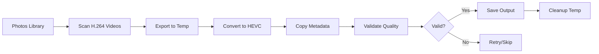

# Photos Library Workflow

Guide for working with macOS Photos library.

## Overview

Video Converter integrates with macOS Photos library to:

- Scan videos and identify H.264 content
- Export videos for conversion
- Preserve all metadata including GPS
- Optionally re-import converted videos

## Workflow Diagram



## Basic Usage

### Preview Library (Dry Run)

Use `--dry-run` to scan and preview what would be converted:

```bash
video-converter run --source photos --dry-run
```

**Output:**
```
Scanning Photos library...

Found 89 H.264 videos to convert.
Total size: 45.2 GB
Estimated savings: ~22.6 GB (50%)

Dry run complete.
```

### Convert All H.264 Videos

```bash
video-converter run --source photos
```

### Filter by Album

```bash
# Convert only specific albums
video-converter run --source photos --albums "Vacation 2024"

# Exclude specific albums
video-converter run --source photos --exclude-albums "Screenshots"
```

### Filter by Date

```bash
# Convert videos from specific date range
video-converter run --source photos --from-date 2024-01-01 --to-date 2024-06-30
```

## iCloud Handling

!!! note "iCloud Videos"
    Videos stored only in iCloud are automatically skipped during conversion.
    To convert iCloud videos, first download them to your Mac through Photos app.

## Metadata Preservation

Video Converter preserves:

- **Creation date**: Original capture timestamp
- **GPS coordinates**: Location data in multiple formats
- **Camera info**: Device model, lens information
- **Custom metadata**: Title, description, keywords

### Verify Metadata

```bash
# Check metadata after conversion
exiftool -GPS* -CreateDate converted_video.mp4
```

## Output Options

### Default Output Location

```
~/Videos/VideoConverter/output/
```

### Custom Output Directory

```bash
video-converter run --source photos --output-dir ~/Movies/Converted
```

## Re-import to Photos

!!! note "Experimental Feature"
    Re-importing to Photos is experimental. Original videos are preserved by default.

```bash
# Convert and re-import
video-converter run --source photos --reimport

# Re-import and archive originals to a specific album
video-converter run --source photos --reimport --archive-album "Converted Originals"

# Re-import and keep both versions
video-converter run --source photos --reimport --keep-originals
```

## Best Practices

1. **Preview first**: Use `--dry-run` to understand the scope before converting
2. **Backup important videos**: Keep originals until verified
3. **Convert during idle time**: Use automation for overnight processing
4. **Monitor disk space**: Ensure 2-3x the source video size is available
