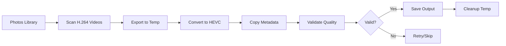

# Photos Library Workflow

Guide for working with macOS Photos library.

## Overview

Video Converter integrates with macOS Photos library to:

- Scan videos and identify H.264 content
- Export videos for conversion
- Preserve all metadata including GPS
- Optionally re-import converted videos

## Workflow Diagram



## Basic Usage

### Preview Library (Dry Run)

Use `--dry-run` to scan and preview what would be converted:

```bash
video-converter run --source photos --dry-run
```

**Output:**
```
Scanning Photos library...

Found 89 H.264 videos to convert.
Total size: 45.2 GB
Estimated savings: ~22.6 GB (50%)

Dry run complete.
```

### Convert All H.264 Videos

```bash
video-converter run --source photos
```

### Filter by Album

```bash
# Convert only specific album
video-converter run --mode photos --album "Vacation 2024"

# Exclude specific albums
video-converter run --mode photos --exclude-album "Screenshots"
```

### Filter by Date

```bash
# Convert videos from specific date range
video-converter run --mode photos --from "2024-01-01" --to "2024-06-30"
```

## iCloud Handling

### Check iCloud Status

```bash
video-converter scan --mode photos --show-icloud
```

### Download and Convert

```bash
# Download iCloud videos before conversion
video-converter run --mode photos --download-icloud
```

!!! warning "iCloud Downloads"
    Downloading iCloud videos requires internet connection and may take time.
    Ensure sufficient local storage.

## Metadata Preservation

Video Converter preserves:

- **Creation date**: Original capture timestamp
- **GPS coordinates**: Location data in multiple formats
- **Camera info**: Device model, lens information
- **Custom metadata**: Title, description, keywords

### Verify Metadata

```bash
# Check metadata after conversion
exiftool -GPS* -CreateDate converted_video.mp4
```

## Output Options

### Default Output Location

```
~/Videos/VideoConverter/output/
```

### Custom Output Directory

```bash
video-converter run --mode photos --output ~/Movies/Converted
```

### Organize by Date

```bash
video-converter run --mode photos --organize-by-date
```

Creates structure:
```
output/
├── 2024/
│   ├── 01/
│   ├── 02/
│   └── ...
└── 2023/
    └── ...
```

## Re-import to Photos

!!! note "Experimental Feature"
    Re-importing to Photos is experimental. Original videos are preserved.

```bash
# Convert and re-import
video-converter run --mode photos --reimport

# Re-import with duplicate handling
video-converter run --mode photos --reimport --skip-duplicates
```

## Best Practices

1. **Start with a scan**: Always scan first to understand the scope
2. **Dry run first**: Use `--dry-run` to preview actions
3. **Backup important videos**: Keep originals until verified
4. **Convert during idle time**: Use automation for overnight processing
5. **Monitor disk space**: Ensure 2-3x the source video size is available
