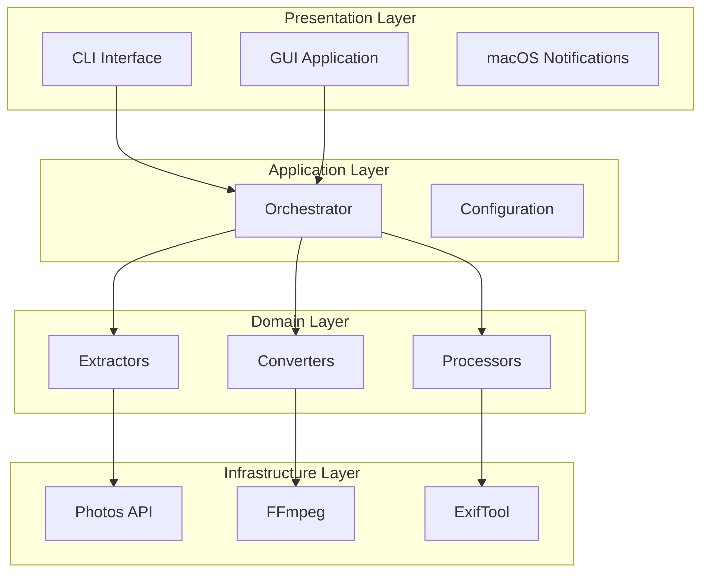

# Video Converter

Automated H.264 to H.265 video conversion for macOS with Photos library integration.

## Overview

Video Converter is a powerful command-line tool that automatically converts H.264 videos to H.265 (HEVC) format, leveraging Apple Silicon's hardware acceleration for blazing-fast performance. It integrates seamlessly with macOS Photos library.

## Key Features

- **Hardware Acceleration**: Uses Apple VideoToolbox for 20x+ realtime conversion on Apple Silicon
- **Photos Integration**: Direct access to macOS Photos library with metadata preservation
- **GPS Preservation**: Maintains location data through multiple format support
- **Quality Validation**: VMAF-based quality checking ensures conversion fidelity
- **Automation**: Schedule conversions via launchd for hands-free operation
- **GUI Application**: Native macOS GUI for easy access (v0.3.0+)

## Quick Start

```bash
# Install
pip install video-converter

# Convert a single file
video-converter convert input.mp4 output.mp4

# Convert all H.264 videos in Photos library
video-converter run --mode photos

# Scan without converting
video-converter scan --mode photos
```

## Architecture



## System Requirements

| Requirement | Minimum | Recommended |
|-------------|---------|-------------|
| macOS | 12.0 (Monterey) | 14.0+ (Sonoma) |
| CPU | Apple M1 | Apple M2 Pro+ |
| RAM | 8GB | 16GB+ |
| Python | 3.10 | 3.12 |

## Installation

=== "pip"

    ```bash
    pip install video-converter
    ```

=== "From Source"

    ```bash
    git clone https://github.com/kcenon/video_converter.git
    cd video_converter
    pip install -e ".[dev]"
    ```

## Documentation

- [Quick Start Guide](quick-start.md) - Get started in 5 minutes
- [User Guide](guides/cli-usage.md) - Complete CLI reference
- [API Reference](api/core.md) - Python API documentation
- [Architecture](architecture/01-system-architecture.md) - System design

## License

MIT License - see [LICENSE](https://github.com/kcenon/video_converter/blob/main/LICENSE) for details.
